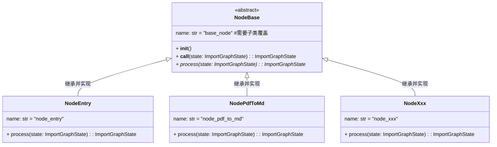
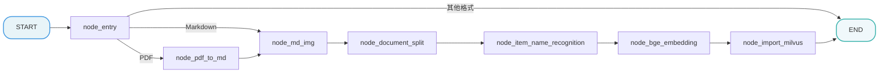

# 掌柜智库项目(RAG)实战

## 4. 导入数据图与状态定义

### 4.1 定义节点状态

所有节点共享同一个状态对象。我们需要定义它来存储处理过程中的数据（如 PDF 路径、MD 内容、切片列表、向量等）。

**文件**: `app/import_process/agent/state.py`

```python
import json
from typing import TypedDict
import copy
from app.core.logger import logger

class ImportGraphState(TypedDict):
    """
    图的状态定义，包含所有节点产生和消费的数据字段。
    TypedDict 让我们在代码中能有自动补全和类型检查。
    使用字典式访问（如state["session_id"]、state.get("embedding_chunks")）
    """
    task_id: str          # 任务唯一ID，用于追踪日志

    # --- 流程控制标记 ---
    is_md_read_enabled: bool   # 是否启用 Markdown 读取路径
    is_pdf_read_enabled: bool  # 是否启用 PDF 读取路径


    # --- 切块相关 ---
    is_normal_split_enabled: bool
    is_silicon_flow_api_enabled: bool
    is_advanced_split_enabled: bool
    is_vllm_enabled: bool

    # --- 路径相关 ---
    local_dir: str        # 当前工作目录或输出目录
    local_file_path: str  # 原始输入文件路径
    file_title: str       # 文件标题（文件名去后缀）
    pdf_path: str         # PDF 文件路径 (如果输入是PDF)
    md_path: str          # Markdown 文件路径 (转换后或直接输入的)
    split_path: str       # 分块后的文件路径
    embeddings_path: str  # 向量数据库文件路径

    # --- 内容数据 ---
    md_content: str       # Markdown 的全文内容
    chunks: list          # 切片后的文本列表，包含 metadata
    item_name: str        # 识别出的主体名称 (如: "万用表")，用于增强检索

    # --- 数据库相关 ---
    embeddings_content: list # 包含向量数据的列表，准备写入 Milvus


# 建议定一个初始化对象，方便后续使用
# 定义图状态的默认初始值
graph_default_state: ImportGraphState = {
    "task_id":"",
    "is_pdf_read_enabled": False,
    "is_md_read_enabled": False,
    "is_normal_split_enabled": True,
    "is_silicon_flow_api_enabled": True,
    "is_advanced_split_enabled": False,
    "is_vllm_enabled": False,
    "local_dir": "",
    "local_file_path": "",
    "pdf_path": "",
    "md_path": "",
    "file_title": "",
    "split_path": "",
    "embeddings_path": "",
    "md_content": "",
    "chunks": [],
    "item_name": "",
    "embeddings_content": []
}

def create_default_state(**overrides) -> ImportGraphState:
    """
    创建默认状态，支持覆盖
    优势：
    ✅ 自动填充所有字段的默认值
    ✅ 只需传需要覆盖的字段
    ✅ 避免遗漏字段
    ✅ 深拷贝隔离，避免污染全局状态
    ✅ 代码更简洁、可读性更好
    用法:state = create_default_state(task_id="task_001", local_file_path="doc.pdf")
    :param overrides: 要覆盖的字段（关键字参数解包）
    :return: 新的状态实例
    """

    # 默认状态
    state = copy.deepcopy(graph_default_state)
    # 用 overrides 覆盖默认值
    state.update(overrides)
    # 返回创建好的状态字典实例
    return state

def get_default_state() -> ImportGraphState:
    """
    返回一个新的状态实例，避免全局变量污染
    """
    return copy.deepcopy(graph_default_state)


if __name__ == "__main__":
    """
    测试
    """

    # ❌ 缺少默认参数
    # initial_state = ImportGraphState(
    #     task_id="task_001",
    #     local_file_path="万用表的使用.txt"
    # )

    # ✅ 创建默认状态
    state = create_default_state(local_file_path="万用表RS-12的使用.pdf")
    logger.info(state)
```

### 4.2 定义节点

#### 4.2.1 定义第一个节点

**在 `app/import_process_v1/agent/nodes` 目录下创建以下文件**

**(1) 节点1: `node_1.py`**

```python
import sys

from app.core.logger import logger
from app.import_process_v1.agent.state import ImportGraphState


def node_1(state: ImportGraphState) -> ImportGraphState:


    node_name = sys._getframe().f_code.co_name

    logger.info("记录开始日志：" + node_name)
    logger.info("添加节点状态跟踪" + node_name)

    try:


        # TODO 节点核心处理逻辑

        logger.info("添加节点状态跟踪" + node_name)

        logger.info("记录结束日志" + node_name)

        return state

    except Exception as e:

        # 统一处理所有步骤的异常
        error_msg = f"【{node_name}】流程执行失败：{str(e)}"
        logger.exception(error_msg, e)

        raise
```

如果所有节点均按照这种方式定义，则冗余代码过多，也无法统一处理节点的日志、任务追踪、异常捕获等通用功能，因此我们将节点优化成面向对象的形式定义。

#### 4.2.2 定义所有节点的基类

`NodeBase` 是基于 Python ABC 实现的导入流程抽象基类，核心设计目标是 “复用通用逻辑、约束子类行为”：

- **通用逻辑封装**：`__call__` 方法统一处理节点执行的日志、任务追踪、异常捕获，降低子类开发成本；
- **子类约束**：通过 `__init__` 强制子类覆盖 `name` 属性，通过 `@abstractmethod` 要求子类实现核心业务方法 `process`；
- **集成适配**：完全兼容 LangGraph 工作流引擎，实例化后可直接作为节点加入工作流，保证导入流程的标准化执行。




请在 `app/import_process/agent` 目录下创建文件 `node_base.py`，内容如下：

```python
from abc import ABC, abstractmethod
from time import sleep

from app.core.logger import logger
from app.import_process.agent.state import ImportGraphState
from app.utils.format_utils import format_state
from app.utils.task_utils import add_running_task, add_done_task


class NodeBase(ABC):
    """
    导入流程节点基类
    所有节点类都应继承此基类，实现 process 方法
    使用示例:
        class NodeXx(BaseNode):
            name = "node_xx"
            def process(self, state):
                # 实现具体逻辑
                return state

        # 作为 LangGraph 节点使用
        node_xx = NodeXx()
        workflow.add_node("node_xx", node_xx)
    """

    #节点名称，子类应覆盖
    name: str = "base_node"


    def __init__(self):
        """
        强制子类设置 name
        """
        if self.name == "base_node":
            raise ValueError(f"子类 {self.__class__.__name__} 必须覆盖 name 类属性")


    def __call__(self, state: ImportGraphState) -> ImportGraphState:
         """
         节点执行入口
         LangGraph 调用节点时会调用此方法，提供统一的日志输出、任务追踪和异常处理
         :param state: 工作流状态对象
         :return: 更新后的状态对象
         """

         # 节点启动日志，打印当前工作流状态
         logger.info(f"{'*' * 20}【{self.name}】节点启动{'*' * 20}")
         logger.debug(f"【{self.name}】节点当前工作流状态：{format_state(state)}")

         # 开始：记录节点运行状态
         # 此处为任务追踪，后面会讲
         add_running_task(state["task_id"], self.name)

         try:

             # sleep(1)

             # 节点核心处理逻辑
             state = self.process(state)

             # 结束：记录节点运行状态
             # 此处为任务追踪，后面会讲
             add_done_task(state["task_id"], self.name)

             # 节点完成日志，打印当前工作流状态
             logger.debug(f"【{self.name}】节点更新后工作流状态：{format_state(state)}")
             logger.info(f"{'*' * 20}【{self.name}】节点执行完成{'*' * 20}\n")

             return state

         except Exception as e:

             # 统一处理所有步骤的异常
             error_msg = f"【{self.name}】流程执行失败：{str(e)}"
             logger.exception(error_msg, e) # logger.exception 会打印完整的堆栈跟踪，等同于下面的用法
             # logger.exception(error_msg, exc_info=True)  # exc_info=True 会打印完整的堆栈跟踪

             raise  # 重新抛出异常，确保工作流引擎知道此节点失败并停止后续流程

    @abstractmethod
    def process(self, state: ImportGraphState) -> ImportGraphState:
        """
        节点核心处理逻辑
        子类必须实现此方法
        :param state: 工作流状态对象
        :return: 更新后的状态对象
        """
        pass
```

**定义一个测试用节点：**请在 `app/import_process/agent` 目录下创建文件`node_demo.py`

```python
# app/import_process/agent/nodes/node_demo.py
from app.core.logger import logger
from app.import_process.agent.node_base import NodeBase
from app.import_process.agent.state import ImportGraphState, create_default_state

class NodeDemo(NodeBase):
    name: str = "node_demo"
    def process(self, state: ImportGraphState) -> ImportGraphState:
        logger.info("当前节点的具体业务逻辑")
        logger.debug("当前节点的状态调试信息")

        return state

if __name__ == "__main__":
    node_demo = NodeDemo()
    node_state = create_default_state(
        task_id="task_demo"
    )
    # node_demo.process(state) #只执行业务逻辑
    node_demo(node_state) #包含日志、任务追踪、统一异常处理

```

### 4.3 定义主图 

为了确保整体流程设计的科学性与执行连贯性，我们采用 **"Top-Down"（自顶向下）** 的开发模式，以 “总指挥部” 的全局视角统筹推进，具体实施步骤如下：

1. **搭建节点骨架（Stubs）**：优先定义全流程所需的所有功能节点，仅保留核心日志打印能力（如节点进入 / 退出日志），暂不实现内部复杂业务逻辑，快速搭建起流程的 “骨架结构”；
2. **串联主图（Graph）**：基于预设的业务流转规则，编写主图逻辑将所有节点骨架按序串联，明确节点间的输入输出关系、分支判断条件（如文件格式分流逻辑），形成完整的流程链路；
3. **验证流程通畅性**：启动端到端测试，验证节点间的调用链路是否通顺、数据流转是否符合预期、分支跳转是否准确，确保流程无阻塞、无逻辑漏洞；
4. **填充节点核心逻辑**：在流程链路验证通过后，再逐一聚焦每个节点的内部实现，完成复杂业务逻辑的开发（如 PDF 结构化转换、向量编码、重排序算法等），实现 “骨架” 到 “完整系统” 的落地。

该模式的核心优势在于：先保障 “流程走得通”，再聚焦 “功能做得好”，避免因局部逻辑复杂导致整体流程设计偏差，大幅提升开发效率与流程稳定性。

#### 4.3.1 第一步：创建节点骨架

我们需要先创建以下 8 个文件，每个文件里只写一个最简单的“空函数”，确保主图能导入它们。
**请在 `app/import_process/agent/nodes` 目录下创建以下文件：**

**(1) 入口节点: `node_entry.py`**

```python
from app.core.logger import logger
from app.import_process.agent.node_base import NodeBase
from app.import_process.agent.state import ImportGraphState

class NodeEntry(NodeBase):
    """
    节点: 入口节点
    作为图的 Entry Point，负责接收外部输入并决定流程走向。
    """

    # 覆盖基类的 name 属性，标识节点名称
    name: str = "node_entry"

    def process(self, state: ImportGraphState) -> ImportGraphState:
        """
        节点逻辑
        :param state: 工作流状态对象
        :return: 更新后的状态对象
        """
        
        # TODO
        logger.info(f"【{self.name}】节点逻辑")

        # 模拟简单的路由逻辑
        if "local_file_path" in state:
            path = state["local_file_path"]
            if path.endswith(".pdf"):
                state["is_pdf_read_enabled"] = True
            elif path.endswith(".md"):
                state["is_md_read_enabled"] = True

        return state
```

节点测试：直接在当前文件下方添加测试代码即可

```python
if __name__ == '__main__':

    from app.import_process.agent.state import create_default_state

    # 单元测试：覆盖不支持类型、MD、PDF三种场景
    logger.info("===== 开始node_entry节点单元测试 =====")

    # 测试1: 不支持的TXT文件
    test_state1 = create_default_state(
        task_id="test_entry_task_001",
        local_file_path="联想海豚用户手册.txt"
    )
    node_entry1 = NodeEntry()
    node_entry1(test_state1)

    # 测试2: MD文件
    test_state2 = create_default_state(
        task_id="test_entry_task_002",
        local_file_path="小米用户手册.md"
    )
    node_entry2 = NodeEntry()
    node_entry2(test_state2)

    # 测试3: PDF文件
    test_state3 = create_default_state(
        task_id="test_entry_task_003",
        local_file_path="万用表的使用.pdf"
    )
    node_entry3 = NodeEntry()
    node_entry3(test_state3)

    logger.info("===== 结束node_entry节点单元测试 =====")
```

**(2) PDF转换节点: `node_pdf_to_md.py`**

```python
from app.import_process.agent.node_base import NodeBase
from app.import_process.agent.state import ImportGraphState
from app.core.logger import logger 

class NodePdfToMd(NodeBase):
    """
    节点: PDF转Markdown (node_pdf_to_md)
    核心任务是将 PDF 非结构化数据转换为 Markdown 结构化数据。
    """

    # 覆盖基类的 name 属性，标识节点名称
    name: str = "node_pdf_to_md"

    def process(self, state: ImportGraphState) -> ImportGraphState:
        """
        节点逻辑
        :param state: 工作流状态对象
        :return: 更新后的状态对象
        """

        # TODO
        logger.info(f"【{self.name}】节点逻辑")

        return state
```

**(3) 图片处理节点: `node_md_img.py`**

```python
from app.import_process.agent.node_base import NodeBase
from app.import_process.agent.state import ImportGraphState
from app.core.logger import logger

class NodeMdImg(NodeBase):
    """
    节点: 图片处理
    处理 Markdown 中的图片资源。
    """

    # 覆盖基类的 name 属性，标识节点名称
    name: str = "node_md_img"

    def process(self, state: ImportGraphState) -> ImportGraphState:
        """
        节点逻辑
        :param state: 工作流状态对象
        :return: 更新后的状态对象
        """

        # TODO
        logger.info(f"【{self.name}】节点逻辑")

        return state
```

**(4) 文档切分节点: `node_document_split.py`**

```python
from app.core.logger import logger
from app.import_process.agent.node_base import NodeBase
from app.import_process.agent.state import ImportGraphState

class NodeDocumentSplit(NodeBase):
    """
    节点: 文档切分
    将长文档切分成小的 Chunks (切片) 以便检索。
    """

    # 覆盖基类的 name 属性，标识节点名称
    name: str = "node_document_split"

    def process(self, state: ImportGraphState) -> ImportGraphState:
        """
        节点逻辑
        :param state: 工作流状态对象
        :return: 更新后的状态对象
        """

        # TODO
        logger.info(f"【{self.name}】节点逻辑")

        return state
```

**(5) 主体识别节点: `node_item_name_recognition.py`**

```python
from app.core.logger import logger
from app.import_process.agent.node_base import NodeBase
from app.import_process.agent.state import ImportGraphState

class NodeItemNameRecognition(NodeBase):
    """
    节点: 主体识别
    识别文档核心描述的物品/商品名称
    """

    # 覆盖基类的 name 属性，标识节点名称
    name: str = "node_item_name_recognition"

    def process(self, state: ImportGraphState) -> ImportGraphState:
        """
        节点逻辑
        :param state: 工作流状态对象
        :return: 更新后的状态对象
        """

        # TODO
        logger.info(f"【{self.name}】节点逻辑")

        return state
```

**(6) 向量化节点: `node_bge_embedding.py`**

```python
from app.core.logger import logger
from app.import_process.agent.node_base import NodeBase
from app.import_process.agent.state import ImportGraphState

class NodeBgeEmbedding(NodeBase):
    """
    节点: 向量化
    使用 BGE-M3 模型将文本转换为向量。
    """

    # 覆盖基类的 name 属性，标识节点名称
    name: str = "node_bge_embedding"

    def process(self, state: ImportGraphState) -> ImportGraphState:
        """
        节点逻辑
        :param state: 工作流状态对象
        :return: 更新后的状态对象
        """

        # TODO
        logger.info(f"【{self.name}】节点逻辑")

        return state
```

**(7) 写入Milvus节点: `node_import_milvus.py`**

```python
from app.core.logger import logger
from app.import_process.agent.node_base import NodeBase
from app.import_process.agent.state import ImportGraphState

class NodeImportMilvus(NodeBase):
    """
    节点: 导入向量库
    为什么叫这个名字: 将处理好的向量数据写入 Milvus 数据库。
    """

    # 覆盖基类的 name 属性，标识节点名称
    name: str = "node_import_milvus"

    def process(self, state: ImportGraphState) -> ImportGraphState:
        """
        节点逻辑
        :param state: 工作流状态对象
        :return: 更新后的状态对象
        """

        # TODO
        logger.info(f"【{self.name}】节点逻辑")

        return state
```

#### 4.3.2 第二步：编写主图代码

节点思路总结：



**文件**: `app/import_process/agent/main_graph.py`

```python
from dotenv import load_dotenv
from langchain_core.callbacks.manager import handle_event
from langgraph.constants import START, END
from langgraph.graph import StateGraph

from app.core.logger import logger
from app.import_process.agent.nodes.node_bge_embedding import NodeBgeEmbedding
from app.import_process.agent.nodes.node_document_split import NodeDocumentSplit
from app.import_process.agent.nodes.node_entry import NodeEntry
from app.import_process.agent.nodes.node_import_milvus import NodeImportMilvus
from app.import_process.agent.nodes.node_item_name_recognition import NodeItemNameRecognition
from app.import_process.agent.nodes.node_md_img import NodeMdImg
from app.import_process.agent.nodes.node_pdf_to_md import NodePdfToMd
from app.import_process.agent.state import ImportGraphState, create_default_state
from app.utils.format_utils import format_state

load_dotenv()

# 1、初始化状态图，指定整个状态图中的状态类型
workflow = StateGraph(ImportGraphState)

# 2、注册所有的业务节点
# 2.1 创建节点
node_entry = NodeEntry()
node_pdf_to_md = NodePdfToMd()
node_md_img = NodeMdImg()
node_document_split = NodeDocumentSplit()
node_item_name_recognition = NodeItemNameRecognition()
node_bge_embedding = NodeBgeEmbedding()
node_import_milvus = NodeImportMilvus()
# 2.2 注册节点
workflow.add_node("node_entry", node_entry)
workflow.add_node("node_pdf_to_md", node_pdf_to_md)
workflow.add_node("node_md_img", node_md_img)
workflow.add_node("node_document_split", node_document_split)
workflow.add_node("node_item_name_recognition", node_item_name_recognition)
workflow.add_node("node_bge_embedding", node_bge_embedding)
workflow.add_node("node_import_milvus", node_import_milvus)

# 3、设置工作流的入口节点
workflow.set_entry_point("node_entry")
# 等同于
# workflow.add_edge(START, "node_entry")

# 4、定义条件边
# 4.1 定义条件路由
def route_after_entry(state: ImportGraphState) -> str:
    # PDF导入
    if state["is_pdf_read_enabled"]:
        return "node_pdf_to_md"
    # MD导入
    elif state["is_md_read_enabled"]:
        return "node_md_img"
    # 流程终止
    else:
        return END
# 4.2 注册条件边
workflow.add_conditional_edges(
    "node_entry", # 入口节点
    route_after_entry, #条件路由

    # 如果不执行后面的 print_ascii()的话，这句话可以省略掉
    {
        "node_pdf_to_md":"node_pdf_to_md",
        "node_md_img":"node_md_img",
        END:END
    }
)

# 5、注册顺序边
workflow.add_edge("node_pdf_to_md", "node_md_img")
workflow.add_edge("node_md_img", "node_document_split")
workflow.add_edge("node_document_split", "node_item_name_recognition")
workflow.add_edge("node_item_name_recognition", "node_bge_embedding")
workflow.add_edge("node_bge_embedding", "node_import_milvus")
workflow.add_edge("node_import_milvus", END)

# 6、编译工作流
kb_import_app = workflow.compile()
```

#### 4.3.3 第三步：验证图流程

在实现具体业务逻辑前，我们先跑一个测试脚本，看看图能不能跑通，路线对不对。

💡如果不希望看到`节点内`输出的状态信息，可以将日志调整到 `INFO` 级别

💡分别测试不同扩展名的文件，查看工作流的路由

```python
# 测试
if __name__ == "__main__":

    # 1 初始化状态信息
    init_state = create_default_state(
        task_id="task_001",
        local_file_path="d:/abc.cmd"
    )

    # 2（invoke） 运行工作流
    # 在图的外部，仅在整个图的执行过程都结束之后，我们才能够拿到最终的状态
    # final_state = kb_import_app.invoke(init_state)
    # print(format_state(final_state))

    # 2（stream）运行工作流
    # 在图的外部，每执行完一个节点，就可以输出当前的state
    for chunk in kb_import_app.stream(init_state):
        # chunk：字典
        logger.info(chunk.keys())
        logger.info(chunk.items())

    logger.info("输出图结构:")
    # 以下代码需要 uv add grandalf
    kb_import_app.get_graph().print_ascii()
```

**预期效果**:
你应该能看到控制台依次打印出每个节点的日志：

*   PDF 流程应包含：`node_entry` -> `node_pdf_to_md` -> `node_md_img` -> ... -> `node_import_milvus`
*   Markdown 流程应包含：`node_entry` -> `node_md_img` -> ... -> `node_import_milvus` **(跳过了 node_pdf_to_md)**
*   其他格式的文档只包含：`node_entry`**（直接结束）**

**如果能看到这些日志，说明我们的图结构搭建成功！接下来就可以放心地去填充每个节点的具体代码了。**

### 4.4 代码优化

#### 4.4.1 代码实现

将 LangGraph 工作流代码改造成**类的形式**，而且改造后会更符合面向对象设计规范、更易维护扩展（比如支持多实例、自定义配置、流程复用）。以下是完整的改造方案：

**文件**: `app/import_process/agent/kb_import_workflow.py`

```python
import os

from dotenv import load_dotenv
from langgraph.constants import END
from langgraph.graph import StateGraph
from typing import Optional

from app.core.logger import logger
from app.import_process.agent.nodes.node_bge_embedding import NodeBgeEmbedding
from app.import_process.agent.nodes.node_document_split import NodeDocumentSplit
from app.import_process.agent.nodes.node_entry import NodeEntry
from app.import_process.agent.nodes.node_import_milvus import NodeImportMilvus
from app.import_process.agent.nodes.node_item_name_recognition import NodeItemNameRecognition
from app.import_process.agent.nodes.node_md_img import NodeMdImg
from app.import_process.agent.nodes.node_pdf_to_md import NodePdfToMd
from app.import_process.agent.state import ImportGraphState, create_default_state

# 初始化环境变量（类加载前执行，保证全局生效）
load_dotenv()


class KBImportWorkflow:
    """
    知识库导入工作流类
    封装LangGraph工作流的构建、编译、执行逻辑，支持自定义配置和多实例运行
    """
    def __init__(self):
        """初始化工作流：创建状态图、注册节点、定义路由规则"""
        # 1. 初始化LangGraph状态图
        self.workflow = StateGraph(ImportGraphState)
        # 2. 初始化所有业务节点（实例属性，支持多实例隔离）
        self._init_nodes()
        # 3. 注册节点到工作流
        self._register_nodes()
        # 4. 设置入口和路由规则
        self._setup_routes()
        # 5. 编译工作流（懒加载，首次执行时编译）
        self._compiled_app: Optional[object] = None

    def _init_nodes(self):
        """初始化所有业务节点（私有方法，封装节点创建逻辑）"""
        self.node_entry = NodeEntry()
        self.node_pdf_to_md = NodePdfToMd()
        self.node_md_img = NodeMdImg()
        self.node_document_split = NodeDocumentSplit()
        self.node_item_name_recognition = NodeItemNameRecognition()
        self.node_bge_embedding = NodeBgeEmbedding()
        self.node_import_milvus = NodeImportMilvus()

    def _register_nodes(self):
        """注册所有节点到工作流（私有方法，统一管理节点注册）"""
        # 节点标识与实例属性名保持一致，便于维护
        self.workflow.add_node("node_entry", self.node_entry)
        self.workflow.add_node("node_pdf_to_md", self.node_pdf_to_md)
        self.workflow.add_node("node_md_img", self.node_md_img)
        self.workflow.add_node("node_document_split", self.node_document_split)
        self.workflow.add_node("node_item_name_recognition", self.node_item_name_recognition)
        self.workflow.add_node("node_bge_embedding", self.node_bge_embedding)
        self.workflow.add_node("node_import_milvus", self.node_import_milvus)

    def _route_after_entry(self, state: ImportGraphState) -> str:
        """入口节点后的条件路由函数（私有方法，封装路由逻辑）"""
        if state.get("is_md_read_enabled"):
            return "node_md_img"
        elif state.get("is_pdf_read_enabled"):
            return "node_pdf_to_md"
        else:
            return END

    def _setup_routes(self):
        """设置工作流路由规则（私有方法，封装边的定义）"""
        # 设置入口节点
        self.workflow.set_entry_point("node_entry")
        # 注册条件路由边
        self.workflow.add_conditional_edges(
            "node_entry",
            self._route_after_entry,
            {
                "node_md_img": "node_md_img",
                "node_pdf_to_md": "node_pdf_to_md",
                END: END
            }
        )
        # 注册静态顺序边
        self.workflow.add_edge("node_pdf_to_md", "node_md_img")
        self.workflow.add_edge("node_md_img", "node_document_split")
        self.workflow.add_edge("node_document_split", "node_item_name_recognition")
        self.workflow.add_edge("node_item_name_recognition", "node_bge_embedding")
        self.workflow.add_edge("node_bge_embedding", "node_import_milvus")
        self.workflow.add_edge("node_import_milvus", END)

    def compile(self):
        """编译工作流（如果已编译则直接获取结果）"""
        if not self._compiled_app:
            self._compiled_app = self.workflow.compile()
        return self._compiled_app

    def run(self, initial_state: ImportGraphState, stream: bool = False) -> ImportGraphState:
        """
        统一执行入口，支持切换invoke/stream
        :param initial_state:  初始状态对象
        :param stream: 是否是流式输出
        :return: 执行完成后的状态对象
        """
        """"""
        if not self._compiled_app:
            self.compile()
        if stream:
            return self._compiled_app.stream(initial_state)
        else:
            return self._compiled_app.invoke(initial_state)

    @classmethod
    def create_and_run(cls, initial_state: ImportGraphState, stream: bool = False) -> ImportGraphState:
        """
        快捷方法：创建工作流实例并立即执行（兼容原有函数式调用习惯）
        :param initial_state: 初始状态对象
        :param stream: 是否是流式输出
        :return: 执行完成后的状态对象
        """
        workflow = cls()
        return workflow.run(initial_state, stream)


# ===================== 用法示例 =====================

if __name__ == "__main__":

    # 定义初始状态
    init_state = create_default_state(
        task_id="task_demo",
        local_file_path="万用表的使用.pdf"
    )

    # 用法1：标准类用法（推荐，支持多实例）
    # 创建工作流实例
    kb_import_app = KBImportWorkflow()
    # 执行工作流
    final_state = kb_import_app.run(init_state)
    logger.info(f"工作流执行完成！最终状态: {final_state}")

    # 用法2：快捷调用
    for chunk in KBImportWorkflow.create_and_run(init_state, stream=True):
        # chunk：字典类型
        logger.info(chunk.keys())
        logger.info(chunk.items())
```

#### 4.4.2 设计原则和细节

将工作流封装为类，是从‘脚本式开发’到‘工程化开发’的关键一步 —— 通过面向对象设计，让流程更易维护、扩展，同时天然支持多实例并发，适配生产环境的复杂需求。

- 封装：内部逻辑私有化，对外暴露简洁接口；
- 复用：支持继承扩展、多实例运行；
- 兼容：保留原有核心逻辑，提供快捷调用方式；

关键设计细节

- **私有方法（`_xxx`）**：封装内部逻辑（节点初始化、路由定义），对外隐藏实现细节，符合 “封装” 原则；
- **懒加载编译**：`compile()` 方法仅在首次执行时触发，避免重复编译；
- **类方法**：`create_and_run` 支持快捷调用，降低使用成本；
- **实例隔离**：每个 `KBImportWorkflow` 实例拥有独立的节点实例和工作流对象，并发安全。


