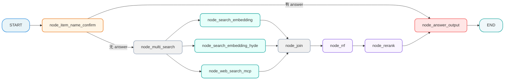
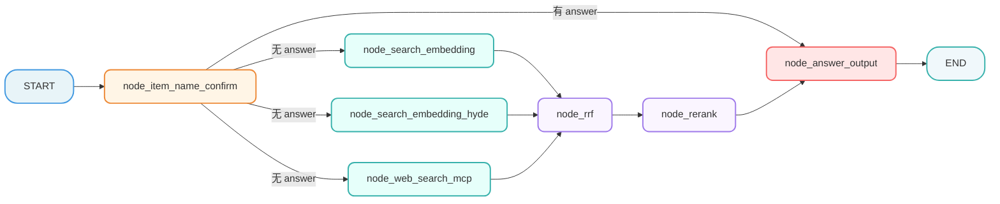

# 掌柜智库项目(RAG)实战

## 7. 检索数据图与状态定义

### 7.1 定义状态 (State)

所有节点共享同一个状态对象。我们需要定义它来存储处理过程中的数据（如 查询原始问题、改写问题、历史对话、不同方向切片结果等）。

**文件**: `app/query_process/agent/state.py`

```python

from typing import List, TypedDict
import copy
from app.core.logger import logger

class QueryGraphState(TypedDict):
    """
    QueryGraphState 定义了整个查询流程中流转的数据结构。
    TypedDict 让我们在代码中能有自动补全和类型检查。
    使用字典式访问（如 state["session_id"]、state.get("original_query")）
    """

    task_id: str          # 任务唯一ID，用于追踪日志

    session_id: str  # 会话唯一标识
    original_query: str  # 用户原始问题

    # 检索过程中的中间数据
    embedding_chunks: list  # 普通向量检索回来的切片
    hyde_embedding_chunks:list # 已向量化的假设性问题切片
    web_search_docs: list  # 网络搜索回来的文档

    # 排序过程中的数据
    rrf_chunks: list  # RRF 融合排序后的切片
    reranked_docs: list  # 重排序后的最终 Top-K 文档

    # 生成过程中的数据
    prompt: str  # 组装好的 Prompt
    answer: str  # 最终生成的答案

    # 辅助信息
    item_names: List[str]  # 提取出的商品名称
    rewritten_query: str  # 改写后的问题
    history: list  # 历史对话记录
    is_stream: bool  # 是否流式输出标记


# 定义图状态的默认初始值
graph_default_state: QueryGraphState = {
    "task_id":"",
    "session_id": "",
    "original_query": "",
    "embedding_chunks": [],
    "hyde_embedding_chunks": [],
    "web_search_docs": [],
    "rrf_chunks": [],
    "reranked_docs": [],
    "prompt": "",
    "answer": "",
    "item_names": [],
    "rewritten_query": "",
    "history": [],
    "is_stream": False
}


def create_default_state(**overrides) -> QueryGraphState:
    """
    创建默认状态，支持覆盖
    优势：
    ✅ 自动填充所有字段的默认值
    ✅ 只需传需要覆盖的字段
    ✅ 避免遗漏字段
    ✅ 深拷贝隔离，避免污染全局状态
    ✅ 代码更简洁、可读性更好

    用法：state = create_default_state(session_id="sess_001", original_query="如何使用万用表？")

    :param overrides: 要覆盖的字段（关键字参数解包）
    :return: 新的状态实例
    """
    # 默认状态
    state = copy.deepcopy(graph_default_state)
    # 用 overrides 覆盖默认值
    state.update(overrides)
    # 返回创建好的状态字典实例
    return state


def get_default_state() -> QueryGraphState:
    """
    返回一个新的状态实例，避免全局变量污染
    """
    return copy.deepcopy(graph_default_state)


if __name__ == "__main__":
    """
    测试
    """
    # ✅ 创建默认状态
    state = create_default_state(
        task_id="task_001",
        session_id="query_20260331_001",
        original_query="如何使用万用表测量电压？"
    )

    logger.info(state)

```

### 7.2 定义所有节点的基类

请在 `app/query_process/agent` 目录下创建文件 `node_base.py`，内容如下：

```python
from abc import ABC, abstractmethod
from app.core.logger import logger
from app.query_process.agent.state import QueryGraphState
from app.utils.format_utils import format_state
from app.utils.task_utils import add_running_task, add_done_task


class NodeBase(ABC):
    """
    查询流程节点基类
    所有节点类都应继承此基类，实现 process 方法
    使用示例:
        class NodeXx(BaseNode):
            name = "node_xx"
            def process(self, state):
                # 实现具体逻辑
                return state

        # 作为 LangGraph 节点使用
        node_xx = NodeXx()
        workflow.add_node("node_xx", node_xx)
    """

    #节点名称，子类应覆盖
    name: str = "base_node"


    def __init__(self):
        """
        强制子类设置 name
        """
        if self.name == "base_node":
            raise ValueError(f"子类 {self.__class__.__name__} 必须覆盖 name 类属性")


    def __call__(self, state: QueryGraphState) -> QueryGraphState:
         """
         节点执行入口
         LangGraph 调用节点时会调用此方法，提供统一的日志输出、任务追踪和异常处理
         :param state: 工作流状态对象
         :return: 更新后的状态对象
         """

         # 节点启动日志，打印当前工作流状态
         logger.info(f"{'*' * 20}【{self.name}】节点启动{'*' * 20}")
         logger.debug(f"【{self.name}】节点当前工作流状态：{format_state(state)}")

         # 开始：记录节点运行状态
         # 此处为任务追踪，后面会讲
         # add_running_task(state["task_id"], self.name)

         try:

             # sleep(1)

             # 节点核心处理逻辑
             state = self.process(state)

             # 结束：记录节点运行状态
             # 此处为任务追踪，后面会讲
             # add_done_task(state["task_id"], self.name)

             # 节点完成日志，打印当前工作流状态
             logger.debug(f"【{self.name}】节点更新后工作流状态：{format_state(state)}")
             logger.info(f"{'*' * 20}【{self.name}】节点执行完成{'*' * 20}\n")

             return state

         except Exception as e:

             # 统一处理所有步骤的异常
             error_msg = f"【{self.name}】流程执行失败：{str(e)}"
             logger.exception(error_msg, e) # logger.exception 会打印完整的堆栈跟踪，等同于下面的用法
             # logger.exception(error_msg, exc_info=True)  # exc_info=True 会打印完整的堆栈跟踪

             raise  # 重新抛出异常，确保工作流引擎知道此节点失败并停止后续流程

    @abstractmethod
    def process(self, state: QueryGraphState) -> QueryGraphState:
        """
        节点核心处理逻辑
        子类必须实现此方法
        :param state: 工作流状态对象
        :return: 更新后的状态对象
        """
        pass
```

### 7.3 定义主图 

为了确保整体流程设计的科学性与执行连贯性，我们采用 **"Top-Down"（自顶向下）** 的开发模式，以 “总指挥部” 的全局视角统筹推进，具体实施步骤如下：

1. **搭建节点骨架（Stubs）**：优先定义全流程所需的所有功能节点，仅保留核心日志打印能力（如节点进入 / 退出日志），暂不实现内部复杂业务逻辑，快速搭建起流程的 “骨架结构”；
2. **串联主图（Graph）**：基于预设的业务流转规则，编写主图逻辑将所有节点骨架按序串联，明确节点间的输入输出关系、分支判断条件，形成完整的流程链路；
3. **验证流程通畅性**：启动端到端测试，验证节点间的调用链路是否通顺、数据流转是否符合预期、分支跳转是否准确，确保流程无阻塞、无逻辑漏洞；
4. **填充节点核心逻辑**：在流程链路验证通过后，再逐一聚焦每个节点的内部实现，完成复杂业务逻辑的开发（如 查询重写、定向查询、结果重排处理等），实现 “骨架” 到 “完整系统” 的落地。

该模式的核心优势在于：先保障 “流程走得通”，再聚焦 “功能做得好”，避免因局部逻辑复杂导致整体流程设计偏差，大幅提升开发效率与流程稳定性。

#### 7.3.1 第一步：创建节点骨架

我们需要先创建以下 8 个文件，每个文件里只写一个最简单的“空函数”，确保主图能导入它们。
**请在 `app/query_process/agent/nodes` 目录下创建以下文件，并将对应代码复制进去。**

**(1) 意图确认: `node_item_name_confirm.py`**

这个节点主要干了 4 件事：

1. 提取与改写 ：结合历史对话提取商品名，并将模糊问题改写为完整独立的精准问题。
2. 向量化检索 ：将提取出的商品名在 Milvus 向量库中进行混合搜索。
3. 标准化对齐 ：根据评分高低自动对齐标准型号，或生成反问让用户手动确认。
4. 同步历史记录 ：将改写后的问题、确认的商品名和处理状态实时写入 MongoDB 数据库。

```python
from app.query_process.agent.node_base import NodeBase
from app.core.logger import logger
from app.query_process.agent.state import QueryGraphState


class NodeItemNameConfirm(NodeBase):
    """
    节点功能：确认用户问题中的核心商品名称。
    """

    # 覆盖基类的 name 属性，标识节点名称
    name: str = "node_item_name_confirm"

    def process(self, state: QueryGraphState) -> QueryGraphState:
        """
        节点逻辑
        :param state: 工作流状态对象
        :return: 更新后的状态对象
        """

        # TODO
        logger.info(f"【{self.name}】节点逻辑")

        return state
```

**(2) 向量检索: `node_search_embedding.py`**

这个节点 node_search_embedding 负责根据 改写后的用户问题 ，在 限定的商品范围内 ，利用 BGEM3 混合检索（稠密+稀疏） 技术，从 Milvus 向量数据库中召回 Top5 最相关的知识切片。

```python
from app.query_process.agent.node_base import NodeBase
from app.core.logger import logger
from app.query_process.agent.state import QueryGraphState

class NodeSearchEmbedding(NodeBase):
     """
    节点功能：基于已确认主体名+改写后的用户问题，执行Milvus向量数据库混合检索
    """

     # 覆盖基类的 name 属性，标识节点名称
     name: str = "node_search_embedding"

     def process(self, state: QueryGraphState) -> QueryGraphState:
         """
         节点逻辑
         :param state: 工作流状态对象
         :return: 更新后的状态对象
         """

         # TODO
         logger.info(f"【{self.name}】节点逻辑")

         # return state
         return {"embedding_chunks":  []}
```

**(3) HyDE 假设检索节点: `node_search_embedding_hyde.py`**

这个节点 node_search_embedding_hyde 实现了 HyDE (Hypothetical Document Embeddings) 策略，核心逻辑是 先让 LLM 虚构一个“理想答案”，再用这个答案去向量库检索真实的文档 。

一句话总结： 它通过“LLM 生成假设性答案”来增强原始问题的语义信息，再进行混合向量检索，从而大幅提升对“语义匹配但字面不匹配”问题的召回能力。

```python
from app.query_process.agent.node_base import NodeBase
from app.core.logger import logger
from app.query_process.agent.state import QueryGraphState

class NodeSearchEmbeddingHyde(NodeBase):
    """
    节点功能：HyDE (Hypothetical Document Embedding)
    先让 LLM 生成假设性答案，再对答案进行向量检索，提高召回率。
    """

    # 覆盖基类的 name 属性，标识节点名称
    name: str = "node_search_embedding_hyde"

    def process(self, state: QueryGraphState) -> QueryGraphState:
        """
        节点逻辑
        :param state: 工作流状态对象
        :return: 更新后的状态对象
        """

        # TODO
        logger.info(f"【{self.name}】节点逻辑")

        # return state
        return {"hyde_embedding_chunks": []}
```

**(4) 网络搜索节点: `node_web_search_mcp.py`**

这个节点 node_web_search_mcp 负责调用 百炼 MCP (Model Context Protocol) 联网搜索服务 ，获取互联网上的实时信息。

一句话总结： 它通过 MCP 协议异步调用百炼联网搜索接口，将用户的查询转化为实时的、结构化的网络搜索结果（包含标题、链接和摘要）。

```python
from app.query_process.agent.node_base import NodeBase
from app.core.logger import logger
from app.query_process.agent.state import QueryGraphState

class NodeWebSearchMcp(NodeBase):
    """
    节点功能，调用外部搜索引擎补充信息
    """

    # 覆盖基类的 name 属性，标识节点名称
    name: str = "node_web_search_mcp"

    def process(self, state: QueryGraphState) -> QueryGraphState:
        """
        节点逻辑
        :param state: 工作流状态对象
        :return: 更新后的状态对象
        """

        # TODO
        logger.info(f"【{self.name}】节点逻辑")

        # return state
        return {"web_search_docs": []}
```


**(5) 倒排融合排序节点: `node_rrf.py`**

这个节点 node_rrf 负责 将来自不同检索源（如向量检索、HyDE 检索、知识图谱等）的文档列表进行统一合并和重新排序 。它消除了不同检索方式的分数差异，给出一个综合排名最高的文档列表（Top 10）。

什么是 RRF (Reciprocal Rank Fusion, 倒排排序融合)？

RRF 是一种 不需要知道具体分数，只关心排名 的融合算法。

通俗解释： 假设你在参加一场全能比赛：

- 裁判 A（向量检索） 觉得你是第 1 名。
- 裁判 B（HyDE 检索） 觉得你是第 3 名。
- 裁判 C（关键字检索） 觉得你是第 10 名。

RRF 不管裁判打具体多少分（因为不同裁判打分标准不同，有的满分100，有的满分10），它只看 排名 。

计算公式：


- rank 是你在某个裁判那里的排名（第1名就是1，第2名就是2）。
- k 是一个常数（通常取 60），用来防止排名靠前的差距过大。

RRF 的核心思想：

- 奖励多面手 ：如果你在多个榜单上都排在前面，你的总分就会很高。
- 平滑差异 ：即使你在某个榜单上稍微落后，只要其他榜单表现好，总分依然能上去。
- 去重 ：同一个文档在不同榜单出现多次，RRF 会把它合并，只算一次总分。

举个栗子：假设我们有两个检索来源：

1. 来源 A (向量检索) 找出了前 3 名：

   - 第 1 名： 文档 X
   - 第 2 名： 文档 Y
   - 第 3 名： 文档 Z
2. 来源 B (HyDE 检索) 找出了前 3 名：

   - 第 1 名： 文档 Y (注意：它觉得 Y 比 X 好)
   - 第 2 名： 文档 Z
   - 第 3 名： 文档 W (新面孔)

我们来算一下每个文档的总分：

1. 文档 X

* 在 A 中排第 1 → 得分 = 1 / (60 + 1) = 0.0164

- 在 B 中没出现 → 得分 = 0
- 总分 = 0.0164 + 0 = 0.0164

2. 文档 Y (重点看这个！)

- 在 A 中排第 2 → 得分 = 1 / (60 + 2) = 0.0161
- 在 B 中排第 1 → 得分 = 1 / (60 + 1) = 0.0164
- 总分 = 0.0161 + 0.0164 = 0.0325

3. 文档 Z

- 在 A 中排第 3 → 得分 = 1 / (60 + 3) = 0.0159
- 在 B 中排第 2 → 得分 = 1 / (60 + 2) = 0.0161
- 总分 = 0.0159 + 0.0161 = 0.0320

4. 文档 W

- 在 A 中没出现 → 得分 = 0
- 在 B 中排第 3 → 得分 = 1 / (60 + 3) = 0.0159
- 总分 = 0 + 0.0159 = 0.0159

最终排名结果：

1. 第一名：文档 Y (0.0325) (虽然在 A 排第二，但在 B 排第一，综合实力最强)
2. 第二名：文档 Z (0.0320) (两个榜单都上榜，表现稳定)
3. 第三名：文档 X (0.0164) (偏科，只在 A 表现好)
4. 第四名：文档 W (0.0159)

总结： RRF 就是通过这种方式，让 “在多个榜单都靠前” 的文档排到最前面，比单看某一个榜单更靠谱！

```python
from app.query_process.agent.node_base import NodeBase
from app.core.logger import logger
from app.query_process.agent.state import QueryGraphState

class NodeRrf(NodeBase):
    """
    节点功能：Reciprocal Rank Fusion
    将多路召回的结果（向量、HyDE、Web）进行加权融合排序。
    """

    # 覆盖基类的 name 属性，标识节点名称
    name: str = "node_rrf"

    def process(self, state: QueryGraphState) -> QueryGraphState:
        """
        节点逻辑
        :param state: 工作流状态对象
        :return: 更新后的状态对象
        """

        # TODO
        logger.info(f"【{self.name}】节点逻辑")

        return state
```

**(6) 重排序节点: `node_rerank.py`**

这个节点 node_rerank 是知识库检索的“精修师”，它对之前所有步骤召回的文档进行 二次精细排序 。

核心流程分为三步：

1. 合并文档 ：将来自 RRF（本地检索）和 Web Search（联网搜索）的文档合并到一个池子中。
2. 精确打分 ：使用重排序模型计算每个文档与用户问题的相关性得分。
3. 动态截断 ：根据得分的“断崖式下跌”点，智能截取 TopK（最多 10 条），只保留高质量结果，过滤凑数的低分文档。

该节点使用的是 BGE Reranker (BAAI/bge-reranker-large) 模型。

- 模型类型 ：Cross-Encoder（交叉编码器）。
- 工作原理 ：它不像向量检索那样分别计算向量再比对，而是直接把“问题”和“文档”拼接在一起扔给模型，让模型像阅读理解一样，深入分析两者的语义匹配度。
- 特点 ：
  - 精度极高 ：能识别微小的语义差异（如“苹果手机”和“苹果公司”的区别）。
  - 速度较慢 ：因为计算量大，所以通常只用于对初筛后的少量文档（如 Top 20-50）进行精排，不适合全库检索。

```python
from app.query_process.agent.node_base import NodeBase
from app.core.logger import logger
from app.query_process.agent.state import QueryGraphState

class NodeRerank(NodeBase):
    """
    节点功能：使用 Cross-Encoder 模型对 RRF 后的结果进行精确打分重排。
    """

    # 覆盖基类的 name 属性，标识节点名称
    name: str = "node_rerank"

    def process(self, state: QueryGraphState) -> QueryGraphState:
        """
        节点逻辑
        :param state: 工作流状态对象
        :return: 更新后的状态对象
        """

        # TODO
        logger.info(f"【{self.name}】节点逻辑")

        return state
```

**(7) 答案生成: `node_answer_output.py`**

这个节点 node_answer_output 是知识库查询的“最后一公里”，负责 生成最终回答 并 交付给用户 。

它整合了之前所有步骤的成果，通过以下 5 个核心动作完成任务：

1. 检查前置答案 ：如果之前步骤（如商品名确认节点）已经生成了追问或拒绝回答，直接输出，跳过 LLM 生成。
2. 构建 Prompt ：将用户问题、历史对话、以及 Rerank 后的 TopK 高质量文档片段（包含元数据）组装成一段严谨的提示词。
3. LLM 生成与流式推送 ：调用大模型生成最终答案。如果是流式模式，会**逐字推送（Delta）**给前端，实现打字机效果。
4. 图片提取与增强 ：从引用文档中自动提取图片 URL（包括网页链接和本地 Markdown 图片），为纯文本答案补充视觉信息。
5. 收尾与存档 ：将最终答案和提取的图片写入 MongoDB 历史记录，并向前端发送包含完整信息（答案+图片）的 FINAL 信号 。

```python
from app.query_process.agent.node_base import NodeBase
from app.core.logger import logger
from app.query_process.agent.state import QueryGraphState


class NodeAnswerOutput(NodeBase):
    """
    节点功能: 答案生成
    """

    # 覆盖基类的 name 属性，标识节点名称
    name: str = "node_answer_output"

    def process(self, state: QueryGraphState) -> QueryGraphState:
        """
        节点逻辑
        :param state: 工作流状态对象
        :return: 更新后的状态对象
        """

        # TODO
        logger.info(f"【{self.name}】节点逻辑")

        return state
```

#### 7.3.2 第二步：编写主图代码 

##### v1




**文件**: `app/query_process/agent/kb_query_workflow.py`

```python
from typing import Optional

from dotenv import load_dotenv
from langgraph.constants import END
from langgraph.graph import StateGraph
from app.core.logger import logger
from app.query_process.agent.nodes.node_answer_output import NodeAnswerOutput
from app.query_process.agent.nodes.node_item_name_confirm import NodeItemNameConfirm
from app.query_process.agent.nodes.node_rerank import NodeRerank
from app.query_process.agent.nodes.node_rrf import NodeRrf
from app.query_process.agent.nodes.node_search_embedding import NodeSearchEmbedding
from app.query_process.agent.nodes.node_search_embedding_hyde import NodeSearchEmbeddingHyde
from app.query_process.agent.nodes.node_web_search_mcp import NodeWebSearchMcp
from app.query_process.agent.state import QueryGraphState, create_default_state

# 初始化环境变量（类加载前执行，保证全局生效）
load_dotenv()


class KBQueryWorkflow:
    """
    知识库查询工作流类
    封装LangGraph工作流的构建、编译、执行逻辑，支持自定义配置和多实例运行
    """
    def __init__(self):
        """初始化工作流：创建状态图、注册节点、定义路由规则"""
        # 1. 初始化LangGraph状态图
        self.workflow = StateGraph(QueryGraphState)
        # 2. 初始化所有业务节点（实例属性，支持多实例隔离）
        self._init_nodes()
        # 3. 注册节点到工作流
        self._register_nodes()
        # 4. 设置入口和路由规则
        self._setup_routes()
        # 5. 编译工作流（懒加载，首次执行时编译）
        self._compiled_app: Optional[object] = None

    def _init_nodes(self):
        """初始化所有业务节点（私有方法，封装节点创建逻辑）"""
        self.node_item_name_confirm = NodeItemNameConfirm()
        self.node_search_embedding = NodeSearchEmbedding()
        self.node_search_embedding_hyde = NodeSearchEmbeddingHyde()
        self.node_web_search_mcp = NodeWebSearchMcp()
        self.node_rrf = NodeRrf()
        self.node_rerank = NodeRerank()
        self.node_answer_output = NodeAnswerOutput()

    def _register_nodes(self):
        """注册所有节点到工作流（私有方法，统一管理节点注册）"""
        # 节点标识与实例属性名保持一致，便于维护
        self.workflow.add_node("node_item_name_confirm", self.node_item_name_confirm) # 确认主体
        self.workflow.add_node("node_multi_search", lambda x: x) # 虚拟节点：多路搜索分叉点（状态不变）
        self.workflow.add_node("node_search_embedding", self.node_search_embedding) # 向量搜索
        self.workflow.add_node("node_search_embedding_hyde", self.node_search_embedding_hyde) #假设性答案向量搜索
        self.workflow.add_node("node_web_search_mcp", self.node_web_search_mcp) # 联网搜索
        self.workflow.add_node("node_join", lambda x: {}) # 虚拟节点：多路搜索合并点
        self.workflow.add_node("node_rrf", self.node_rrf) # 排序
        self.workflow.add_node("node_rerank", self.node_rerank) # 重排
        self.workflow.add_node("node_answer_output", self.node_answer_output) # 生成

        # 虚拟节点的作用：作为流程的「分叉 / 合并中转站」，解决多分支流程的组织问题，本身无业务逻辑；
        # lambda x:x 含义：接收 state 并原样返回，是最轻便的 “无逻辑传递” 方式；
        # 普通函数替换：定义 def 函数名(state): return state 即可完全等价，优势是易扩展、易调试；

    def _route_after_item_name_confirm(self, state: QueryGraphState) -> str:
        """主体名称确认后的条件路由函数"""
        if state.get("answer"):
            """
            这主要发生在 node_item_name_confirm 节点无法直接确定唯一的商品型号，从而需要“反问用户”或“拒绝回答”的场景。
            具体来说，有以下两种情况会导致 state 中直接出现 answer ，从而跳过后续的检索流程，直接输出：
            1. 多选一（反问用户） ：
            - 场景 ：用户问得太模糊（比如“华为P60”），系统发现数据库里有“华为P60 128G”和“华为P60 Art”两个型号，且置信度都不足以直接确认。
            - 处理 ：节点会生成一条反问句作为 answer ，例如：“您是想问以下哪个产品：华为P60 128G、华为P60 Art？请明确一下型号。”
            - 结果 ：此时不需要再去检索文档了，直接把这句话发给用户让他选。
            2. 查无此人（拒绝回答） ：

            - 场景 ：用户问了一个系统里压根没有的商品（比如“小米15”，但库里只有华为的数据），或者评分过低（<0.6）。
            - 处理 ：节点会生成一条拒绝句作为 answer ，例如：“抱歉，未找到相关产品，请提供准确型号以便我为您查询。”
            - 结果 ：同样不需要后续检索，直接结束流程。
            """
            return "node_answer_output"
            # 否则继续搜索流程
        return "node_multi_search"


    def _setup_routes(self):
        """设置工作流路由规则"""
        # 1、设置入口节点
        self.workflow.set_entry_point("node_item_name_confirm")

        # 2、注册条件路由边
        self.workflow.add_conditional_edges(
            "node_item_name_confirm",
            self._route_after_item_name_confirm,
            {
                "node_answer_output": "node_answer_output",
                "node_multi_search": "node_multi_search"
            }
        )

        # 3. 并发执行搜索
        self.workflow.add_edge("node_multi_search", "node_search_embedding")
        self.workflow.add_edge("node_multi_search", "node_search_embedding_hyde")
        self.workflow.add_edge("node_multi_search", "node_web_search_mcp")

        # 4. 多路搜索结果合并
        self.workflow.add_edge("node_search_embedding", "node_join")
        self.workflow.add_edge("node_search_embedding_hyde", "node_join")
        self.workflow.add_edge("node_web_search_mcp", "node_join")

        # 5. 合并 -> 排序 -> 重排 -> 生成 -> 结束
        self.workflow.add_edge("node_join", "node_rrf")
        self.workflow.add_edge("node_rrf", "node_rerank")
        self.workflow.add_edge("node_rerank", "node_answer_output")
        self.workflow.add_edge("node_answer_output", END)


    def compile(self):
        """编译工作流（公开方法，支持手动触发编译）"""
        if not self._compiled_app:
            self._compiled_app = self.workflow.compile()
        return self._compiled_app

    def run(self, initial_state: QueryGraphState, stream: bool = False) -> QueryGraphState:
        """
        统一执行入口，支持切换invoke/stream
        :param initial_state:  初始状态对象
        :param stream: 是否是流式输出
        :return: 执行完成后的状态对象
        """
        """"""
        if not self._compiled_app:
            self.compile()

        # self._compiled_app.get_graph().print_ascii()

        if stream:
            return self._compiled_app.stream(initial_state)
        else:
            return self._compiled_app.invoke(initial_state)

    @classmethod
    def create_and_run(cls, initial_state: QueryGraphState, stream: bool = False) -> QueryGraphState:
        """
        快捷方法：创建工作流实例并立即执行（兼容原有函数式调用习惯）
        :param initial_state: 初始状态对象
        :param stream: 是否是流式输出
        :return: 执行完成后的状态对象
        """
        workflow = cls()
        return workflow.run(initial_state, stream)


# ===================== 用法示例 =====================

if __name__ == "__main__":

    # 定义初始状态
    initial_state = create_default_state(
        task_id="task_001",
        session_id="query_20260331_001",
        original_query="如何使用万用表测量电压？"
    )
    # 流式输出
    for chunk in KBQueryWorkflow.create_and_run(initial_state, stream=True):
        pass
```

##### v2



**文件**: `app/query_process/agent/kb_query_workflow_v2.py`

```python
from typing import Optional

from dotenv import load_dotenv
from langgraph.constants import END
from langgraph.graph import StateGraph
from app.query_process.agent.nodes.node_answer_output import NodeAnswerOutput
from app.query_process.agent.nodes.node_item_name_confirm import NodeItemNameConfirm
from app.query_process.agent.nodes.node_rerank import NodeRerank
from app.query_process.agent.nodes.node_rrf import NodeRrf
from app.query_process.agent.nodes.node_search_embedding import NodeSearchEmbedding
from app.query_process.agent.nodes.node_search_embedding_hyde import NodeSearchEmbeddingHyde
from app.query_process.agent.nodes.node_web_search_mcp import NodeWebSearchMcp
from app.query_process.agent.state import QueryGraphState, create_default_state

# 初始化环境变量（类加载前执行，保证全局生效）
load_dotenv()


class KBQueryWorkflowV2:
    """
    知识库查询工作流类
    封装LangGraph工作流的构建、编译、执行逻辑，支持自定义配置和多实例运行
    """
    def __init__(self):
        """初始化工作流：创建状态图、注册节点、定义路由规则"""
        # 1. 初始化LangGraph状态图
        self.workflow = StateGraph(QueryGraphState)
        # 2. 初始化所有业务节点（实例属性，支持多实例隔离）
        self._init_nodes()
        # 3. 注册节点到工作流
        self._register_nodes()
        # 4. 设置入口和路由规则
        self._setup_routes()
        # 5. 编译工作流（懒加载，首次执行时编译）
        self._compiled_app: Optional[object] = None

    def _init_nodes(self):
        """初始化所有业务节点（私有方法，封装节点创建逻辑）"""
        self.node_item_name_confirm = NodeItemNameConfirm()
        self.node_search_embedding = NodeSearchEmbedding()
        self.node_search_embedding_hyde = NodeSearchEmbeddingHyde()
        self.node_web_search_mcp = NodeWebSearchMcp()
        self.node_rrf = NodeRrf()
        self.node_rerank = NodeRerank()
        self.node_answer_output = NodeAnswerOutput()

    def _register_nodes(self):
        """注册所有节点到工作流（私有方法，统一管理节点注册）"""
        # 节点标识与实例属性名保持一致，便于维护
        self.workflow.add_node("node_item_name_confirm", self.node_item_name_confirm) # 确认主体
        self.workflow.add_node("node_search_embedding", self.node_search_embedding) # 向量搜索
        self.workflow.add_node("node_search_embedding_hyde", self.node_search_embedding_hyde) #假设性答案向量搜索
        self.workflow.add_node("node_web_search_mcp", self.node_web_search_mcp) # 联网搜索
        self.workflow.add_node("node_rrf", self.node_rrf) # 排序
        self.workflow.add_node("node_rerank", self.node_rerank) # 重排
        self.workflow.add_node("node_answer_output", self.node_answer_output) # 生成

    def _route_after_item_name_confirm(self, state: QueryGraphState) -> str:
        """主体名称确认后的条件路由函数"""
        if state.get("answer"):
            """
            这主要发生在 node_item_name_confirm 节点无法直接确定唯一的商品型号，从而需要“反问用户”或“拒绝回答”的场景。
            具体来说，有以下两种情况会导致 state 中直接出现 answer ，从而跳过后续的检索流程，直接输出：
            1. 多选一（反问用户） ：
            - 场景 ：用户问得太模糊（比如“华为P60”），系统发现数据库里有“华为P60 128G”和“华为P60 Art”两个型号，且置信度都不足以直接确认。
            - 处理 ：节点会生成一条反问句作为 answer ，例如：“您是想问以下哪个产品：华为P60 128G、华为P60 Art？请明确一下型号。”
            - 结果 ：此时不需要再去检索文档了，直接把这句话发给用户让他选。
            2. 查无此人（拒绝回答） ：

            - 场景 ：用户问了一个系统里压根没有的商品（比如“小米15”，但库里只有华为的数据），或者评分过低（<0.6）。
            - 处理 ：节点会生成一条拒绝句作为 answer ，例如：“抱歉，未找到相关产品，请提供准确型号以便我为您查询。”
            - 结果 ：同样不需要后续检索，直接结束流程。
            """
            return "node_answer_output"

        # 否则继续搜索流程
        return ["node_search_embedding", "node_search_embedding_hyde", "node_web_search_mcp"]


    def _setup_routes(self):
        """设置工作流路由规则"""
        # 1、设置入口节点
        self.workflow.set_entry_point("node_item_name_confirm")

        # 2、注册条件路由边
        self.workflow.add_conditional_edges(
            "node_item_name_confirm",
            self._route_after_item_name_confirm,
            {
                "node_answer_output": "node_answer_output",
                "node_search_embedding": "node_search_embedding",
                "node_search_embedding_hyde": "node_search_embedding_hyde",
                "node_web_search_mcp": "node_web_search_mcp"
            }
        )

        # 3. 多路搜索结果合并
        self.workflow.add_edge("node_search_embedding", "node_rrf")
        self.workflow.add_edge("node_search_embedding_hyde", "node_rrf")
        self.workflow.add_edge("node_web_search_mcp", "node_rrf")

        # 4. 排序 -> 重排 -> 生成 -> 结束
        self.workflow.add_edge("node_rrf", "node_rerank")
        self.workflow.add_edge("node_rerank", "node_answer_output")
        self.workflow.add_edge("node_answer_output", END)


    def compile(self):
        """编译工作流（公开方法，支持手动触发编译）"""
        if not self._compiled_app:
            self._compiled_app = self.workflow.compile()
        return self._compiled_app

    def run(self, initial_state: QueryGraphState, stream: bool = False) -> QueryGraphState:
        """
        统一执行入口，支持切换invoke/stream
        :param initial_state:  初始状态对象
        :param stream: 是否是流式输出
        :return: 执行完成后的状态对象
        """
        """"""
        if not self._compiled_app:
            self.compile()

        self._compiled_app.get_graph().print_ascii()

        if stream:
            return self._compiled_app.stream(initial_state)
        else:
            return self._compiled_app.invoke(initial_state)

    @classmethod
    def create_and_run(cls, initial_state: QueryGraphState, stream: bool = False) -> QueryGraphState:
        """
        快捷方法：创建工作流实例并立即执行（兼容原有函数式调用习惯）
        :param initial_state: 初始状态对象
        :param stream: 是否是流式输出
        :return: 执行完成后的状态对象
        """
        workflow = cls()
        return workflow.run(initial_state, stream)


# ===================== 用法示例 =====================

if __name__ == "__main__":

    # 定义初始状态
    initial_state = create_default_state(
        task_id="task_001",
        session_id="query_20260331_001",
        original_query="如何使用万用表测量电压？"
    )
    # 流式输出
    for chunk in KBQueryWorkflowV2.create_and_run(initial_state, stream=True):
        pass
```

