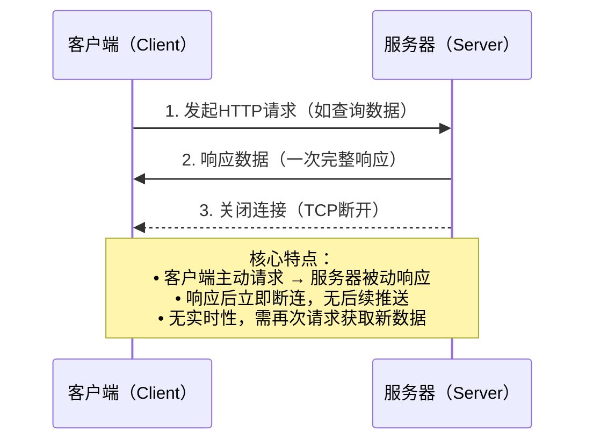
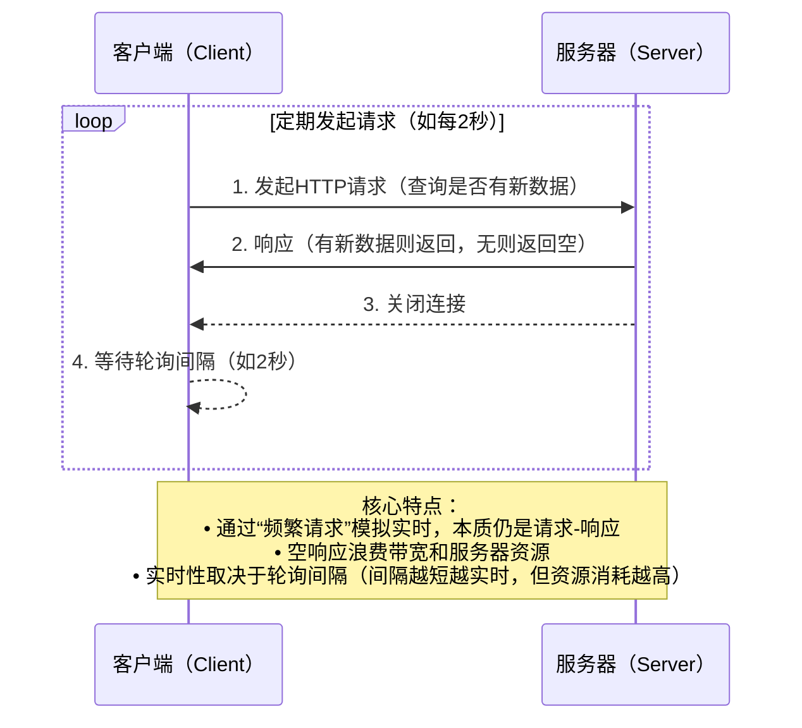
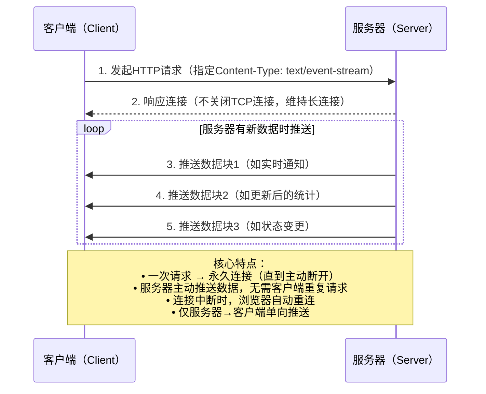

# 掌柜智库项目(RAG)实战

## 8. 检索web服务端搭建

### 8.1 SSE快速入门

SSE (**Server-Sent Events**) 是一种 **基于 HTTP 的服务端单向推送** 技术：浏览器用一个长连接（通常是 GET）订阅，服务端持续向这个连接 **按事件（event）流式写数据**，浏览器按事件回调接收。

- **单向推送**：服务端 → 客户端（客户端发消息仍走普通 HTTP 请求）
- **事件化**：每条消息带 event 类型 + data 数据
- **自动重连**：浏览器 EventSource 断线会自动重连（可配合 retry）
- **轻量**：基于 HTTP，不需要 WebSocket 的双工协议栈

以下通过 **时序流程图** 直观对比 HTTP（含普通短连接、轮询）与 SSE 的核心差异


**一、HTTP 普通短连接（基础模式）**



**二、HTTP 轮询（模拟实时的折中方案）**



**三、SSE（基于 HTTP 长连接的服务器推送）**



#### 8.1.1 应用场景

- **任务进度/阶段状态**：文件上传处理、图执行流程、批处理进度条
- **LLM 流式输出**：边生成边展示（token/片段增量 delta）
- **日志/监控流**：持续输出日志、告警、指标变化
- **通知推送**：轻量通知、状态变化（但不适合高频双向交互）

#### 8.1.2 数据格式

SSE 服务端推送数据 **标准格式**

**一、核心规则**

1. 每条推送消息由 **1～N 行** 组成
2. 每行格式：`键: 值`
3. 一条消息结束必须用 **两个换行符 `\n\n`** 标记
4. 只支持**文本**，不支持二进制

**二、支持的字段**

| 字段     | 说明                                       | 是否必填 |
| :------- | :----------------------------------------- | :------- |
| `event:` | 事件名（自定义，如 progress、result、log） | **可选** |
| `data:`  | 真正要推送的数据内容                       | **必填** |
| `id:`    | 消息 ID（用于断线续传）                    | 可选     |
| `retry:` | 断线后重连间隔（毫秒）                     | 可选     |
| `:`      | 注释行（服务端用来发心跳保活）             | 可选     |

**三、最清晰的示例**

1. 最简单推送

```
data: 上传成功\n\n
```

2. 带事件名的推送

```
event: progress
data: 30\n\n
```

3. 推送 JSON

```
event: status
data: {"status":"processing","progress":50}\n\n
```

4. 多行 data

```
data: 第一步：解析文件
data: 第二步：提取文本
data: 第三步：生成向量
\n\n
```

5. 带重连时间 + 消息 ID

```
id: 1001
retry: 3000
data: 连接正常\n\n
```

6. 心跳保活（防止连接断开）

```
: heartbeat\n\n
```

心跳保活工作流程：

```
1. 前端建立 SSE 连接
2. 服务器正常推送业务数据（进度、状态、日志）
3. 如果一段时间（比如 10 秒）没有业务数据
4. 服务器自动发送一条心跳：  : heartbeat\n\n
5. 防火墙/代理/运营商看到有数据传输 → 不切断连接
6. 前端收到心跳，但自动忽略，不做任何处理
7. 循环保持连接永远不断
```

#### 8.1.3 SSE基础入门

##### 场景一：最基础的 SSE

目标：后端每秒推 1 条固定消息，前端实时显示

**步骤1：后端代码（sse_step1.py）**

```python
import asyncio
from fastapi import FastAPI
from fastapi.responses import StreamingResponse
from fastapi.middleware.cors import CORSMiddleware

# 1. 初始化+跨域（最基础配置）
app = FastAPI()
app.add_middleware(
    CORSMiddleware,        # 启用跨域中间件
    allow_origins=["*"],   # 允许所有来源（任何网页都能调用）
    allow_methods=["*"],   # 允许所有请求方式（GET/POST等）
    allow_headers=["*"],   # 允许所有请求头
)

# 2. 核心：SSE接口（只推固定数据）
@app.get("/simple_stream")
async def simple_stream():
    async def event_generator():
        # 模拟推5条消息，每秒1条
        for i in range(5):
            # ✅ 核心：SSE固定格式 data: 内容\n\n
            yield f"data: 这是第{i+1}条测试消息\n\n"
            await asyncio.sleep(1)  # 每秒推1条
        # yield f"data: [END]\n\n"  # 结束标记

    # ✅ 核心：StreamingResponse + media_type=text/event-stream
    return StreamingResponse(
        event_generator(),
        media_type="text/event-stream"
    )
    
# 用 `async def` 定义，内部通过 `yield` 逐次返回数据（而非 `return` 一次性返回）；
# 每次 `yield` 都会向客户端推送一段数据，直到循环结束；

if __name__ == "__main__":
    import uvicorn
    uvicorn.run(app, host="127.0.0.1", port=8001)
```

**步骤2：前端代码（sse_step1.html）**

```html
<!DOCTYPE html>
<html>
<head>
    <meta charset="UTF-8">
    <title>步骤1：基础SSE</title>
</head>
<body>
    <h3>步骤1：接收后端固定消息</h3>
    <div id="result"></div>

    <script>
        // ✅ 核心：创建EventSource连接SSE接口
        const eventSource = new EventSource("http://127.0.0.1:8001/simple_stream");
        const resultDom = document.getElementById("result");

        // 监听SSE消息（实时接收）
        eventSource.onmessage = function(event) {
            // if (event.data === "[END]") {
            //     eventSource.close();
            //     return;
            // }
            resultDom.innerHTML += event.data + "<br>";
        };
    </script>
</body>
</html>
```

**步骤3：运行演示**

1. 启动后端：`python sse_step1.py`；

2. 打开sse_step1.html，能看到页面每秒显示 1 条消息：

   ```
   这是第1条测试消息
   这是第2条测试消息
   ...
   这是第5条测试消息
   ```

**核心知识点拆解：**

1. `async def` 异步函数

   FastAPI 支持异步接口，async 标识该函数可以执行异步操作（比如 

   await asyncio.sleep(1)），不会阻塞整个服务的其他请求，性能更好。

2. **异步生成器 event_generator()**

   - 用 `async def` 定义，内部通过 `yield` 逐次返回数据（而非 `return` 一次性返回）；
   - 每次 `yield` 都会向客户端推送一段数据，直到循环结束；
   - `await asyncio.sleep(1)` 是异步休眠，区别于 `time.sleep(1)`（同步休眠会阻塞），保证服务能同时处理其他请求。

3. `StreamingResponse` 流式响应

   FastAPI 提供的专门用于 “流式返回数据” 的响应类，接收一个生成器（或异步生成器）作为参数，会逐次把生成器 yield 的内容发送给客户端。

4. **SSE 协议核心规则**

   - 响应的 `media_type` 必须设为 `text/event-stream`，客户端（比如浏览器）才能识别这是 SSE 流；
   - 推送的每条消息必须遵循 `data: 内容\n\n` 格式（`\n\n` 是消息结束的分隔符，缺一不可）；
   - SSE 是**单向通信**（服务器→客户端），适合实时推送通知、日志、进度等场景。

5. **EventSource 自动重连机制详解**

   - EventSource 是浏览器内置的 SSE（Server-Sent Events）客户端 API，它的设计目标是保持与服务器的持久连接。当连接断开时，浏览器会自动尝试重新连接，不需要你手动编写重连代码。

     


##### 场景二：动态传参

目标：前端传会话 ID，后端按 ID 返回专属消息

**步骤1：后端代码（sse_step2.py）**

```python
import asyncio
from fastapi import FastAPI
from fastapi.responses import StreamingResponse
from fastapi.middleware.cors import CORSMiddleware

# 1. 初始化+跨域（最基础配置）
app = FastAPI()
app.add_middleware(
    CORSMiddleware,        # 启用跨域中间件
    allow_origins=["*"],   # 允许所有来源（任何网页都能调用）
    allow_methods=["*"],   # 允许所有请求方式（GET/POST等）
    allow_headers=["*"],   # 允许所有请求头
)
    
# 2、接口接收session_id参数
@app.get("/stream/{session_id}")
async def stream_by_session(session_id: str):

    async def event_generator():
        for i in range(5):
            # 按session_id定制消息
            yield f"data: 会话{session_id} - 第{i+1}条消息\n\n"
            await asyncio.sleep(1)

    if session_id == "123":
        return StreamingResponse(event_generator(), media_type="text/event-stream")
    else:
        return {"message": "无效的会话ID"}
    
if __name__ == "__main__":
    import uvicorn
    uvicorn.run(app, host="127.0.0.1", port=8001)
    
```

**步骤2：前端代码（sse_step2.html）**

```html
<!DOCTYPE html>
<html>
<head>
    <meta charset="UTF-8">
    <title>步骤2：按会话ID推数据</title>
</head>
<body>
    <h3>步骤2：输入会话ID，接收专属消息</h3>
    <input type="text" id="sessionIdInput" placeholder="输入会话ID（如123）" value="123">
    <button onclick="connectSSE()">连接SSE</button>
    <div id="result"></div>

    <script>
        let eventSource = null;
        const resultDom = document.getElementById("result");

        function connectSSE() {
            const sessionId = document.getElementById("sessionIdInput").value;
            resultDom.innerHTML = "";
            
            // ✅ 新增：URL带session_id参数
            eventSource = new EventSource(`http://127.0.0.1:8001/stream/${sessionId}`);
            eventSource.onmessage = function(event) {
                resultDom.innerHTML += event.data + "<br>";
            };
        }
    </script>
</body>
</html>
```

**步骤3：运行演示**

启动后端，打开前端，输入 “abc123” 点击连接，页面显示：

```
会话abc123 - 第1条消息
会话abc123 - 第2条消息
...
```

**核心知识点**

- 后端：通过 URL 路径参数（`session_id`）接收前端传参；
- 前端：SSE 连接的 URL 可动态拼接参数，**实现 “一对一” 推送。**

##### 场景三：异步任务

目标：后端先接收查询请求，后台处理，SSE 推送处理结果

**步骤1： 后端代码（sse_step3.py）**

```python
import asyncio
from fastapi import FastAPI, BackgroundTasks
from fastapi.responses import StreamingResponse
from fastapi.middleware.cors import CORSMiddleware

# 1. 初始化+跨域（最基础配置）
app = FastAPI()
app.add_middleware(
    CORSMiddleware,        # 启用跨域中间件
    allow_origins=["*"],   # 允许所有来源（任何网页都能调用）
    allow_methods=["*"],   # 允许所有请求方式（GET/POST等）
    allow_headers=["*"],   # 允许所有请求头
)

# 2、用异步队列存储每个会话的待推送数据（key: session_id, value: asyncio.Queue）
task_queues = {}


# 异步耗时任务：直接往队列丢数据
async def long_task(session_id: str):
    # 为当前会话创建专属队列
    queue = asyncio.Queue()
    task_queues[session_id] = queue

    # 模拟5秒处理，每秒生成1条结果并丢进队列
    for i in range(5):
        msg = f"会话{session_id}处理结果{i + 1}"
        await queue.put(msg)  # 把数据丢进队列
        await asyncio.sleep(1)

    # 关键：丢一个"结束标记"，告诉SSE可以停止了
    await queue.put(None)


# 提交任务接口
@app.get("/submit/{session_id}")
async def submit_task(session_id: str, background_tasks: BackgroundTasks):
    background_tasks.add_task(long_task, session_id)
    return {"message": "任务已启动", "session_id": session_id}


# 直接从队列取数据
@app.get("/stream/{session_id}")
async def stream_result(session_id: str):
    async def event_generator():
        # 获取当前会话的队列（没有则等待任务创建）
        while session_id not in task_queues:
            await asyncio.sleep(0.1)
        queue = task_queues[session_id]

        # 核心：循环从队列取数据，有数据就推，收到结束标记就停
        while True:
            msg = await queue.get()  # 阻塞等待队列数据
            if msg is None:  # 收到结束标记，退出循环
                break
            yield f"data: {msg}\n\n"  # 推送数据

    return StreamingResponse(event_generator(), media_type="text/event-stream")


if __name__ == "__main__":
    import uvicorn

    uvicorn.run(app, host="127.0.0.1", port=8001)
```

`asyncio.Queue` 是 Python 异步编程（`asyncio` 框架）里的**异步队列**，专门解决异步场景下 “生产者 - 消费者” 的通信问题，你可以把它理解成一个「异步版的消息中转站」—— 生产者（比如你的后台任务）往里面丢数据，消费者（比如你的 SSE 接口）从里面取数据。


核心用法：`asyncio.Queue` 的用法特别简单，核心 3 个方法，且都需要用 `await` 调用（因为是异步操作）：

创建队列

```python
# 创建一个无界异步队列（能装无限多数据）
queue = asyncio.Queue()
# 也可以指定最大容量（比如最多装10条，满了之后put会等待）
queue = asyncio.Queue(maxsize=10)
```

生产者：往队列里放数据（`put`）

```python
await queue.put("要推送的消息")  # 把数据丢进队列
# 如果队列满了（指定了maxsize），这行代码会暂停，直到队列有空闲位置
```

 对应你代码里的后台任务：`await queue.put(msg)`，每秒往队列丢一条消息。

消费者：从队列里取数据（`get`）

```python
msg = await queue.get()  # 从队列取数据
# 如果队列为空，这行代码会「异步暂停」，直到队列里有新数据才唤醒
```

 对应你代码里的 SSE 接口：`msg = await queue.get()`，没有数据就等着，有数据就立刻取。

**步骤2：前端代码（sse_step3.html）**

```html
<!DOCTYPE html>
<html>
<head>
    <meta charset="UTF-8">
    <title>步骤3：异步任务+SSE推送</title>
</head>
<body>
    <h3>步骤3：提交任务，SSE接收处理结果</h3>
    <input type="text" id="sessionIdInput" placeholder="会话ID" value="test001">
    <button onclick="submitTask()">提交任务</button>
    <div id="result"></div>

    <script>
        let eventSource = null;
        const resultDom = document.getElementById("result");

        // 提交任务（触发后端异步处理）
        async function submitTask() {
            const sessionId = document.getElementById("sessionIdInput").value;
            resultDom.innerHTML = "";

            // 1. 调用提交接口
            await fetch(`http://127.0.0.1:8001/submit/${sessionId}`);

            // 2. 立即建立SSE连接，等结果
            eventSource = new EventSource(`http://127.0.0.1:8001/stream/${sessionId}`);
            eventSource.onmessage = function(event) {
                resultDom.innerHTML += event.data + "<br>";
            };
        }
        
        // async 放在函数前面，告诉 JS："这个函数里有等待操作"
        // await 放在调用前面，告诉 JS："这里要等一下结果"
        // 等待期间，JS 引擎可以去处理其他事情（比如响应用户点击）
    </script>
</body>
</html>
```


**步骤3：运行演示**

1. 启动后端，打开前端，点击 “提交任务”；
2. 页面每秒显示 1 条后端处理结果，5 秒后停止。

核心知识点

- 后端：`BackgroundTasks` 实现异步任务，避免阻塞 SSE 连接；
- 核心逻辑：“提交任务→后台处理→SSE 监听结果→实时推送”。

##### 场景四：前端输入查询内容

目标：前端输入查询内容，后端按查询词返回结果

**步骤1：后端代码（sse_step4.py）**

```python
import asyncio
from fastapi import FastAPI, BackgroundTasks
from fastapi.middleware.cors import CORSMiddleware
from fastapi.responses import StreamingResponse
from pydantic import BaseModel

# 1. 初始化+跨域（最基础配置）
app = FastAPI()
app.add_middleware(
    CORSMiddleware,        # 启用跨域中间件
    allow_origins=["*"],   # 允许所有来源（任何网页都能调用）
    allow_methods=["*"],   # 允许所有请求方式（GET/POST等）
    allow_headers=["*"],   # 允许所有请求头
)

# 2、用异步队列存储每个会话的待推送数据（key: session_id, value: asyncio.Queue）
task_queues = {}

# 定义请求体模型
class QueryRequest(BaseModel):
    query: str
    session_id: str

# 重构异步任务：往队列丢数据
async def long_task(session_id: str, query: str):
    # 为当前会话创建专属异步队列
    queue = asyncio.Queue()
    task_queues[session_id] = queue
    
    # 按查询词生成5条结果，每秒1条丢进队列
    for i in range(5):
        msg = f"【{query}】的第{i+1}段回答：xxx{i+1}"
        await queue.put(msg)  # 数据入队
        await asyncio.sleep(1)
    
    # 关键：放入结束标记，告诉SSE停止推送
    await queue.put(None)

# POST接口
@app.post("/submit_query")
async def submit_query(req: QueryRequest, background_tasks: BackgroundTasks):
    # 把查询词和会话ID传给后台任务
    background_tasks.add_task(long_task, req.session_id, req.query)
    return {"message": "任务已启动", "session_id": req.session_id}

# 从队列取数据
@app.get("/stream/{session_id}")
async def stream_result(session_id: str):
    
    async def event_generator():
        # 等待当前会话的队列创建（防止SSE比任务先启动）
        while session_id not in task_queues:
            await asyncio.sleep(0.1)
        queue = task_queues[session_id]
        
        # 循环取队列数据，有数据就推，收到结束标记就停
        while True:
            msg = await queue.get()  # 异步阻塞等待数据
            if msg is None:  # 收到结束标记，退出循环
                break
            yield f"data: {msg}\n\n"  # 推送SSE数据
    
    return StreamingResponse(event_generator(), media_type="text/event-stream")

if __name__ == "__main__":
    import uvicorn
    uvicorn.run(app, host="127.0.0.1", port=8001)
```

**步骤2：前端代码（sse_step4.html)**

```html
<!DOCTYPE html>
<html>
<head>
    <meta charset="UTF-8">
    <title>步骤4：输入查询内容</title>
</head>
<body>
    <h3>步骤4：输入查询内容，SSE接收专属回答</h3>
    <input type="text" id="queryInput" placeholder="输入查询内容" value="Python SSE怎么用">
    <button onclick="submitQuery()">提交查询</button>
    <div id="result"></div>

    <script>
        let eventSource = null;
        const resultDom = document.getElementById("result");

        async function submitQuery() {
            const query = document.getElementById("queryInput").value;
            const sessionId = "query_" + Date.now(); // 自动生成会话ID
            resultDom.innerHTML = "";

            // 1. POST提交查询内容
            await fetch("http://127.0.0.1:8001/submit_query", {
                method: "POST",
                headers: {"Content-Type": "application/json"},
                body: JSON.stringify({query: query, session_id: sessionId})
            });

            // 2. 建立SSE连接
            eventSource = new EventSource(`http://127.0.0.1:8001/stream/${sessionId}`);
            eventSource.onmessage = function(event) {
                resultDom.innerHTML += event.data + "<br>";
            };
        }
    </script>
</body>
</html>
```

**步骤3：运行演示**

输入 “FastAPI 教程”，点击提交，页面显示：

```
【FastAPI教程】的第1段回答：xxx1
【FastAPI教程】的第2段回答：xxx2
...
```

核心知识点

- 后端：用`Pydantic`模型接收 POST 请求体，解析查询内容；
- 前端：POST 请求传 JSON 数据，实现 “用户输入→后端处理→实时返回”。

##### 场景五：SSE 事件属性说明

SSE 协议中，除了核心的 `data` 字段，还支持 `event`（自定义事件类型）、`id`（消息 ID）、`retry`（重连时间）等属性：

- `event`：用于给不同类型的消息标记自定义事件名，前端可以根据事件名区分处理不同消息（比如 “进度更新”“完成通知”）；
- 格式要求：`event: 事件名\n` 必须在 `data: 内容\n\n` 之前；
- 改造方向：在生成 SSE 响应时，为不同阶段的消息（进度、完成）添加不同的 `event` 属性。

**步骤1：后端代码（sse_step5.py）**

```python
import asyncio
import uuid
from fastapi import FastAPI, BackgroundTasks
from fastapi.middleware.cors import CORSMiddleware
from fastapi.responses import StreamingResponse
from pydantic import BaseModel

# 1. 初始化+跨域（最基础配置）
app = FastAPI()
app.add_middleware(
    CORSMiddleware,        # 启用跨域中间件
    allow_origins=["*"],   # 允许所有来源（任何网页都能调用）
    allow_methods=["*"],   # 允许所有请求方式（GET/POST等）
    allow_headers=["*"],   # 允许所有请求头
)

# 2、用异步队列存储每个会话的待推送数据（key: session_id, value: asyncio.Queue）
task_queues = {}


# 定义请求体模型
class QueryRequest(BaseModel):
    query: str
    session_id: str = None


async def long_task(session_id: str, query: str):
    """模拟耗时的异步任务，分阶段往队列丢消息"""

    # 为当前会话创建专属异步队列
    queue = asyncio.Queue()
    task_queues[session_id] = queue

    # 模拟5个进度步骤，往队列丢进度消息
    for i in range(5):
        progress_msg = {
            "event": "progress",
            "data": f"【{query}】的第{i+1}段回答:xxx{i+1}"
        }
        await queue.put(progress_msg)  # 进度消息入队
        await asyncio.sleep(1)

    # 任务完成，往队列丢完成消息
    complete_msg = {
        "event": "complete",
        "data": f"【{session_id}】查询完成！所有结果已返回"
    }
    await queue.put(complete_msg)

    # 关键：放入结束标记，告诉SSE停止推送
    await queue.put(None)


@app.post("/submit_query")
async def submit_query(req: QueryRequest, background_tasks: BackgroundTasks):
    # 把查询词和会话ID传给后台任务
    background_tasks.add_task(long_task, req.session_id, req.query)
    return {"message": "任务已启动", "session_id": req.session_id}


@app.get("/stream/{session_id}")
async def stream_result(session_id: str):

    async def event_generator():
        # 等待当前会话的队列创建（防止SSE比任务先启动）
        while session_id not in task_queues:
            await asyncio.sleep(0.1)
        queue = task_queues[session_id]

        # 循环从队列取消息，有消息就推，收到结束标记就停
        while True:
            msg = await queue.get()  # 异步阻塞等待消息
            if msg is None:  # 收到结束标记，退出循环
                break

            # 拼接自定义Event的SSE格式
            yield f"event: {msg['event']}\n"
            yield f"data: {msg['data']}\n\n"

    return StreamingResponse(event_generator(), media_type="text/event-stream")

if __name__ == "__main__":
    import uvicorn
    uvicorn.run(app, host="127.0.0.1", port=8001)
```

`long_task` 中不再存储纯文本，而是存储包含 `event` 和 `data` 的字典，分别标记消息类型（`progress`/`complete`）和内容；

这样可以区分 “进度更新” 和 “任务完成” 两类消息，前端能针对性处理。

标准 SSE 格式要求：`event: 事件名\n` + `data: 内容\n\n`；

示例输出（前端收到的原始数据）：

```
event: progress
data: 【测试】的第1段回答:xxx1

event: complete
data: 【xxx-xxx-xxx】查询完成！所有结果已返回
```

注意：以下三种写法完全一样。 yield 将 `\n\n` 当做这次输出结束的标志，

```python
# 写法 1：多行写法
yield """event: progress
data: 50\n\n"""
```

```python
# 写法 2：拼接 \n（正确）
yield "event: progress\ndata: 50\n\n"
```

```
# 写法 3：分开 yield（正确）
yield "event: progress\n"
yield "data: 50\n\n"
```


**步骤2：前端代码（sse_step5.html）**

```html
<!DOCTYPE html>
<html>
<head>
    <meta charset="UTF-8">
    <title>步骤5：SSE 事件属性说明</title>
    <style>
        body { padding: 20px; }
        #result { margin-top: 20px; white-space: pre-wrap; }
        .progress { color: purple; }
        .complete { color: green; }
        .error { color: red; }
    </style>
</head>
<body>
    <h3>步骤5：SSE 事件属性说明</h3>
    <input type="text" id="queryInput" placeholder="输入查询内容" value="Python SSE怎么用">
    <button onclick="submitQuery()">提交查询</button>
    <div id="result"></div>

    <script>
        let eventSource = null;
        const resultDom = document.getElementById("result");

        async function submitQuery() {
            const query = document.getElementById("queryInput").value;
            const sessionId = "query_" + Date.now(); // 自动生成会话ID
            resultDom.innerHTML = "";

            console.log(JSON.stringify({query: query, session_id: sessionId}))

            // 1. POST提交查询内容
            await fetch(`http://127.0.0.1:8001/submit_query`, {
                method: 'POST',
                headers: { 'Content-Type': 'application/json' },
                body: JSON.stringify({query: query, session_id: sessionId})
            });

            // 2. 建立SSE连接
            connectSSE(sessionId);
        }

        // 建立SSE连接的函数
        function connectSSE(sessionId) {

            // 创建新的SSE连接
            eventSource = new EventSource(`http://127.0.0.1:8001/stream/${sessionId}`);

            // 监听进度事件（progress）
            eventSource.addEventListener('progress', (e) => {
                resultDom.innerHTML += `<div class="progress">${e.data}</div>`;
            });

            // 监听完成事件（complete）
            eventSource.addEventListener('complete', (e) => {
                resultDom.innerHTML += `<div class="complete">${e.data}</div>`;
                eventSource.close(); // 完成后关闭连接
            });

            // 监听错误事件
            eventSource.onerror = (e) => {
                resultDom.innerHTML += `<div class="error">连接异常：${e.message || '未知错误'}</div>`;
                eventSource.close();
            };
        }
    </script>
</body>
</html>
```


### 8.2 基础 Web 服务端搭建

本节介绍如何基于 FastAPI 搭建后端服务，提供页面访问和查询接口。

#### 8.2.1 前端交互设计

检索 Web 聊天界面（`chat.html`）的核心结构与数据流转逻辑，该页面直接决定了后端接口的设计规范。


**1）页面核心组件**

- **顶栏 (Topbar)**：展示服务连接状态与流式开关。
- **对话区 (Chat)**：
  - **用户气泡**：展示提问内容。
  - **系统气泡**：集成**文本答案**与**处理进度**（折叠面板），实时展示后台（检索/重排/生成）的执行状态。
- **输入区 (Composer)**：支持快捷发送与多行输入。

**2）数据交互闭环**

前端与后端的全双工交互流程如下：

1. **会话初始化**：加载页面时生成或读取 `session_id`，作为用户唯一标识。
2. **提交任务**：点击发送 -> POST `/query`（携带问题与流式标记） -> 获取 `session_id` 确认任务已接收。
3. **建立长连接 (SSE)**：立即通过 `EventSource` 监听 `/stream/{session_id}`，建立实时通信管道。
4. **事件驱动更新**：
   - `ready`: 连接握手成功。
   - `progress`: **实时更新进度条**（如：正在检索... -> 检索完成）。
   - `delta`: **流式逐字输出**（打字机效果）。
   - `final`: 接收完整答案与引用源。

基于此逻辑，后端需提供 `/query`（任务提交）与 `/stream`（事件推送）两个核心接口。

#### 8.2.2 服务接口设计

本节详细定义查询服务的所有对外接口，包括页面访问、任务提交、流式推送及历史管理。

**1）页面访问接口**

- **路径**: `/chat.html` (GET)
- **功能**: 返回前端聊天界面。
- **响应**: HTML 静态页面。

**2）检索查询接口**

- **路径**: `/query` (POST)

- **功能**: 接收用户提问并启动后台处理图逻辑。

- **参数**:

  ```json
  {
    "query": "万用表怎么测量电压？",
    "session_id": "可选，未传则后台自动生成",
    "is_stream": true // 是否启用流式推送
  }
  ```

- **响应 (is_stream: true)**:

  ```json
  { "message": "结果正在处理中...", "session_id": "xxx-uuid" }
  ```

- **响应 (is_stream: false)**:

  ```json
  { "message": "处理完成！", "session_id": "xxx", "answer": "回答内容...", "done_list": [] }
  ```

**3）流式获取接口 (SSE)**

- **路径**: `/stream/{session_id}` (GET)
- **功能**: 建立 SSE 长连接，实时推送任务进度与生成文本。
- **推送数据格式 (JSON)**:
  - **progress 事件**: `{"done_list": ["节点A", "节点B"], "running_list": ["节点C"]}`
  - **delta 事件**: `{"text": "生成的增量字符"}`
  - **final 事件**: `{"answer": "完整最终答案"}`
  - **error 事件**: `{"error": "错误详情"}`

**4）会话历史查询**

- **路径**: `/history/{session_id}` (GET)

- **功能**: 从 MongoDB 中获取当前会话的历史聊天记录。

- **参数**: `limit` (可选，默认50条)

- **响应**:

  ```json
  {
    "session_id": "xxx",
    "items": [
      {
        "_id": str(r.get("_id")) if r.get("_id") is not None else "",
        "session_id": r.get("session_id", ""),
         "role": r.get("role", ""),
         "text": r.get("text", ""),
         "rewritten_query": r.get("rewritten_query", ""),
          "item_names": r.get("item_names", []),
          "ts": r.get("ts")
        }
    ]
  }
  ```

**5）清空会话历史**

- **路径**: `/history/{session_id}` (DELETE)
- **功能**: 删除 MongoDB 中该会话的所有记录。
- **响应**: `{ "message": "History cleared", "deleted_count": 10 }`

**6）健康检查接口**

- **路径**: `/health` (GET)
- **功能**: 检查服务存活状态。
- **响应**: `{ "ok": True }`

#### 8.2.3 接口代码实现

**1）导入查询页面**

将资料`chat.html`添加到`app/query_process/page`文件夹中！


**3）前后端交互说明**

知识库查询服务的流式响应流程 ，涉及到四个核心模块的协同工作：

1. Web 服务层 ( query_service.py ): 负责接收请求、建立 SSE 连接。
2. SSE 工具层 ( sse_utils.py ): 负责管理消息队列、打包和推送事件。
3. 任务状态层 ( task_utils.py ): 负责记录每个节点的执行进度，并自动触发 SSE 推送。
4. 图节点执行层 ( query_process/ ): 实际的业务逻辑节点（如检索、Rerank、生成答案），它们通过更新状态来驱动进度条。

核心流程时序图：


**2）定义和实现api接口服务**

在 `app/query_process/api` 目录下创建 `query_service.py`，我们将代码拆解为以下几个部分进行实现。

首先引入 FastAPI、Pydantic 以及项目内部的工具类。

```python
from pathlib import Path
import uuid
import uvicorn
from fastapi import FastAPI, BackgroundTasks, HTTPException, Request
from fastapi.responses import FileResponse, StreamingResponse
from pydantic import BaseModel, Field
from starlette.middleware.cors import CORSMiddleware

from app.query_process.agent.kb_query_workflow import KBQueryWorkflow
from app.query_process.agent.state import create_default_state
from app.utils.task_utils import *
from app.utils.sse_utils import create_sse_queue, SSEEvent, sse_generator


# 定义fastapi对象
app = FastAPI(title="query service",description="掌柜智库查询服务！")
# 跨域问题解决
app.add_middleware(
    CORSMiddleware,
    allow_origins=["*"],
    allow_methods=["*"],
    allow_headers=["*"],
)

# 返回chat.html页面
@app.get("/chat.html")  # 对外访问地址
async def chat():
    # 从 api -> query_process
    current_dir_parent_path = Path(__file__).absolute().parent.parent
    # 定义chat.html位置
    chat_html_path = current_dir_parent_path / "page" / "chat.html"
    # 如果不存在，抛出404异常
    if not chat_html_path.exists():
        raise HTTPException(status_code=404, detail=f"没有查询到页面，地址为：{chat_html_path}！")
    return FileResponse(chat_html_path)
```

**3）定义数据模型 (Pydantic)**

定义前端请求的数据结构，确保参数类型安全，并增加兼容字段。

```python
# 定义接口接收的数据结构
class QueryRequest(BaseModel):
    """查询请求数据结构"""
    query: str = Field(..., description="查询内容")  # ...必须填写
    session_id: str = Field(None, description="会话ID")
    is_stream: bool = Field(False, description="是否流式返回")
```

**4）实现核心查询逻辑**

这是最关键的逻辑部分，包含后台任务处理函数 `run_query_graph` 和 API 接口 `/query`。

```python
@app.post("/query")
async def query(background_tasks: BackgroundTasks, request: QueryRequest):
    """
    1 解析参数
    2 更新任务状态
    3 调用处理流程图
    4 返回结果
    :param background_tasks:
    :param request:
    :return:
    """
    user_query = request.query
    session_id = request.session_id if request.session_id else str(uuid.uuid4())

    # 处理是不是流式返回结果
    is_stream = request.is_stream
    if is_stream:
        # 创建一个字典 存储对一个session_id : queue 结果队列
        create_sse_queue(session_id)
    # 更新任务状态
    # 当前会话id作为key! 整体装填处于运行中！
    update_task_status(session_id, TASK_STATUS_PROCESSING,is_stream)

    print("开始处理流程... 是否流式:", is_stream, f"其他参数:{user_query}, session_id:{session_id}")

    if is_stream:
        # 如果是流式，则返回一个流式响应，过程不断地推送
        # 运行执行图对象方法
        background_tasks.add_task(run_query_graph, session_id,user_query,is_stream)
        # 返回结果
        print("开始处理结果....")
        return {
            "message":"结果正在处理中...",
            "session_id":session_id
        }
    else:
        # 同步运行
        run_query_graph(session_id, user_query, is_stream)
        answer = get_task_result(session_id,"answer","")
        return {
            "message":"处理完成！",
            "session_id":session_id,
            "answer":answer,
            "done_list":[]
        }
    
# 定义查询接口
def run_query_graph(session_id: str, user_query: str, is_stream: bool = True):
    print(f"开始流程图处理...{session_id} {user_query} {is_stream}")

    default_state = create_default_state(
        original_query=user_query,
        session_id=session_id,
        is_stream=is_stream
    )
    try:
        # 后期运行
        KBQueryWorkflow.create_and_run(default_state)
        # 整体任务就更新完了！ 接下来就是数据的更新了！
        update_task_status(session_id, TASK_STATUS_COMPLETED, is_stream)
    except Exception as e:
        print(f"流程执行异常: {e}")
        update_task_status(session_id, TASK_STATUS_FAILED, is_stream)
        if is_stream:
            push_to_session(session_id, SSEEvent.ERROR, {"error": str(e)})
            
@app.get("/stream/{session_id}")
async def stream(session_id: str, request: Request):
    print("调用流式/stream...")
    """
    sse 实时返回结果
    """
    return StreamingResponse(
        sse_generator(session_id, request),
        media_type="text/event-stream",
        headers={
            "Cache-Control": "no-cache",
            "Connection": "keep-alive",
            "X-Accel-Buffering": "no"
        }
    )
```

**5）健康检查接口**

```python
# 证明服务器启动即可
@app.get("/health")
async def health():
    """
    检查服务是否正常
    """
    return {"ok": True}
```

**6）启动查询服务**

```python
if __name__ == "__main__":
    uvicorn.run(app, host="127.0.0.1", port=8001)
```


### 8.3 历史对话记录管理

1. **上下文连续**：保留关键信息，支持追问、补充条件与多轮推理不断档。
2. **指代消歧**：如果只考虑本次的问题往往不足以让大模型理解用户的上下文含义，尤其是一些指代比如：“这个设备”，“它”等等。
3. **交互确认**：为明确问题的一些信息，Agent 可能会反问用户一些问题，经过几次确认后才能准确解答后续问题，比如商品的型号。
4. **识别用户**：长期记录对话可以记住用户偏好，最终形成用户画像。

咱们项目这里没有使用 LangChain 的 Checkpointer 方式管理会话，而是自定义了一套基于 MongoDB 的持久化管理策略。

这样做的有很多好处：更加灵活自主，可以根据条件范围查询对话，可以给对话自定义格式，管理查询写入内容。

但是相对来说需要做的开发工作也比较多。

MongoDB 是一种文档数据库，特别适用于存储海量数据，结构简单，关系简单的数据。

*   **性能和单表容量**上都比 MySQL/PostgreSQL 等传统关系型数据库要好。虽比不上 Redis 这种内存数据库，但在持久化能力和检索功能又比内存数据库强上很多。
*   **缺点**是不适合保持有复杂关联关系，查询复杂的场景。

所以对于这种**结构简单、查询简单但数据庞大**的对话信息特别合适。尤其是 MongoDB 的存储基本单元就是一份 **JSON** 文档，与对话也是非常契合。

### 8.4 MongoDB 快速准备

MongoDB 是一个基于分布式文件存储的数据库，由 C++ 语言编写。旨在为 WEB 应用提供可扩展的高性能数据存储解决方案。

#### 8.4.1 Linux 下使用 Docker 安装 MongoDB

**1. 拉取 MongoDB 镜像**

```bash
docker pull mongo:latest

# 也可以使用资料中的镜像
docker load -i mongo.tar
```

**2. 运行 MongoDB 容器**

```bash
docker run -d --name mongo --restart always -p 27017:27017 mongo
```

*   `-p 27017:27017`：将容器的 27017 端口映射到主机的 27017 端口。
*   `--name mongo`：容器名称。

**3. 常用管理命令**

* **查看运行状态**：

  ```bash
  docker ps | grep mongo
  ```

* **停止 MongoDB 容器**：

  ```bash
  docker stop mongo
  ```

* **启动 MongoDB 容器**（停止后再次启动）：

  ```bash
  docker start mongo
  ```

* **重启 MongoDB 容器**：

  ```bash
  docker restart mongo
  ```

**4. 进入 MongoDB 容器**

```bash
docker exec -it mongo mongosh
```

#### 8.4.2 MongoDB 客户端安装 (Windows)

推荐使用 **MongoDB Compass**，这是 MongoDB 官方提供的图形化管理工具。

1.  **下载**：访问 [MongoDB Download Center](https://www.mongodb.com/try/download/compass)，选择 Windows 版本下载安装包。
2.  **安装**：运行下载的 `.exe` 或 `.msi` 文件，按照提示完成安装。
3.  **连接**：
    *   打开 MongoDB Compass。
    *   在连接页面输入连接字符串（URI），例如：`mongodb://localhost:27017`（如果是远程服务器，替换 `localhost` 为服务器 IP）。
    *   点击 **Connect** 按钮。

#### 8.4.3 MongoDB 基本使用 (CRUD)

在 MongoDB 中，数据存储在 **数据库 (Database)** -> **集合 (Collection)** -> **文档 (Document)** 中。

以下操作可以在 `mongosh` 命令行或 MongoDB Compass 的 `Mongosh` 终端中执行。

**1. 创建数据库和集合**

MongoDB 不需要显式创建数据库，当往一个不存在的数据库中写入数据时，它会自动创建。

```javascript
// 切换/创建数据库 'users'
use users
```

**2. 插入文档 (Create)**

```javascript
// 插入一条数据到 'users' 集合
// 语法: db.collection.insertOne(document)
db.users.insertOne({ name: "张三", age: 25, email: "zhangsan@example.com" })

// 插入多条数据
// 语法: db.collection.insertMany([document1, document2, ...])
db.users.insertMany([
  { name: "李四", age: 30, email: "lisi@example.com", city: "Beijing" },
  { name: "王五", age: 28, email: "wangwu@example.com", city: "Shanghai" },
  { name: "赵六", age: 35, email: "zhaoliu@example.com", city: "Beijing" }
])
```

**3. 查询文档 (Read)**

```javascript
// 1. 查询所有数据
// 语法: db.collection.find(query, projection)
db.users.find()

// 2. 等值查询：查询 name 为 "张三" 的数据
db.users.find({ name: "张三" })

// 3. 比较操作符查询：
// $gt (大于), $lt (小于), $gte (大于等于), $lte (小于等于), $ne (不等于)
// 示例：查询 age 大于 25 的数据
db.users.find({ age: { $gt: 25 } })

// 4. 逻辑操作符查询：
// $and (与), $or (或)
// 示例：查询 city 为 "Beijing" 并且 age 小于 30 的数据
db.users.find({ city: "Beijing", age: { $lt: 30 } })

// 示例：查询 city 为 "Beijing" 或者 "Shanghai" 的数据
db.users.find({ $or: [ { city: "Beijing" }, { city: "Shanghai" } ] })

// 5. 包含查询 ($in)
// 示例：查询 age 在 [25, 30] 中的数据
db.users.find({ age: { $in: [25, 30] } })
```

**4. 更新文档 (Update)**

```javascript
// 1. 更新一条数据
// 语法: db.collection.updateOne(filter, update, options)
// $set 操作符用于修改指定字段的值，如果字段不存在则创建
db.users.updateOne(
  { name: "张三" },       // 过滤条件：找到 name 为 "张三" 的第一条文档
  { $set: { age: 26 } }   // 更新操作：将 age 设为 26
)

// 2. 更新多条数据
// 语法: db.collection.updateMany(filter, update, options)
// 示例：将所有 city 为 "Beijing" 的用户的 status 字段设为 "active"
db.users.updateMany(
  { city: "Beijing" },
  { $set: { status: "active" } }
)

// 3. 自增/自减 ($inc)
// 示例：将 name 为 "李四" 的 age 增加 1
db.users.updateOne(
  { name: "李四" },
  { $inc: { age: 1 } }
)
```

**5. 删除文档 (Delete)**

```javascript
// 1. 删除一条数据
// 语法: db.collection.deleteOne(filter)
// 示例：删除 name 为 "王五" 的第一条记录
db.users.deleteOne({ name: "王五" })

// 2. 删除多条数据
// 语法: db.collection.deleteMany(filter)
// 示例：删除 age 大于等于 35 的所有用户
db.users.deleteMany({ age: { $gte: 35 } })

// 删除所有数据 (慎用)
// db.users.deleteMany({})
```

### 8.5 开发基于 MongoDB 的历史对话工具

#### 8.5.1 对话数据结构

```json
{
    "session_id": "",
    "role": "",
    "text": "",
    "rewritten_query": "",
    "item_names": [],
    "ts": 123
}
```

每条数据代表一条对话。

| 字段名              | 说明                  |
| :------------------ | :-------------------- |
| **session_id**      | session id            |
| **role**            | 角色： user\assistant |
| **text**            | 对话文本              |
| **rewritten_query** | 改写后的问题          |
| **item_names**      | 设备名称，可多个      |
| **ts**              | 时间戳 秒             |

#### 8.5.2 添加配置文件

 `.env` 文件中添加以下配置：

```env
#Mongodb的配置
MONGO_URL=mongodb://your ip:27017
MONGO_DB_NAME=kb
```

#### 8.5.3 历史对话工具代码实现

文件位置：app\clients\mongo_history_utils.py


#### 8.5.4 调用历史对话

**1. 在 `query_service.py` 中加入**

```python
@app.get("/history/{session_id}")
async def history(session_id: str, limit: int = 50):
    """
    查询当前会话历史记录
    """
    try:
        records = get_recent_messages(session_id, limit=limit)
        items = []
        for r in records:
            items.append({
                "_id": str(r.get("_id")) if r.get("_id") is not None else "",
                "session_id": r.get("session_id", ""),
                "role": r.get("role", ""),
                "text": r.get("text", ""),
                "rewritten_query": r.get("rewritten_query", ""),
                "item_names": r.get("item_names", []),
                "ts": r.get("ts")
            })
        return {"session_id": session_id, "items": items}
    except Exception as e:
        raise HTTPException(status_code=500, detail=f"history error: {e}")

@app.delete("/history/{session_id}")
async def clear_chat_history(session_id: str):
    count =  clear_history(session_id)
    return {"message": "History cleared", "deleted_count": count}
```

